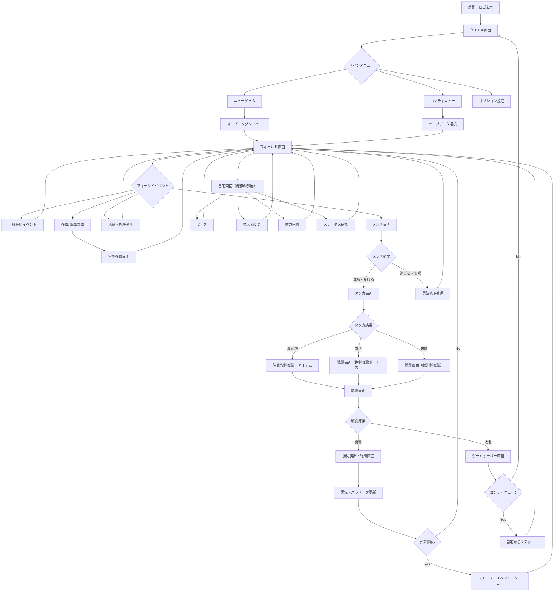

# 画面遷移図 — 喧嘩番長

## メイン画面遷移フローチャート

---

## 各画面の説明一覧

| 画面名 | 概要 | 主な操作 | 遷移先 |
|--------|------|---------|--------|
| タイトル画面 | ロゴ表示・スタートプロンプト | ○ボタンでメニューへ | メインメニュー |
| メインメニュー | ニューゲーム/コンティニュー/オプション選択 | 十字キー＋○ | 各サブ画面 |
| オープニングムービー | プロローグのカットシーン再生 | startでスキップ可 | フィールド |
| フィールド画面 | メイン探索画面。3Dオープンエリアを自由移動 | アナログスティック移動、各ボタンでアクション | 各イベント画面 |
| メンチ画面 | Rボタンでメンチビーム発射。視線対決 | Rボタン長押し→○でケンカ成立 | タンカ画面 or フィールド |
| タンカ画面 | バラバラに表示されるセリフを制限時間内に入力 | 表示ボタンを順番通りに入力 | 戦闘画面 |
| 戦闘画面 | メンチ→タンカ後のどつき合い。3Dアクション | 攻撃・ガード・技発動 | 勝利/ゲームオーバー |
| 勝利画面 | 勝利演出・習得経験値・獲得アイテム表示 | ○で次へ | フィールド or ストーリー |
| ゲームオーバー画面 | 敗北時の演出。コンティニュー確認 | コンティニュー選択 | タイトル or 自宅から再開 |
| 自宅画面 | セーブ・技装備・回復・ステータス確認の拠点 | メニュー選択 | フィールド |
| ステータス画面 | 体力・気合・男気・番長度などの確認 | 参照のみ | 前画面 |
| 電車移動画面 | 各駅への移動選択。時間経過 | 行先選択 | 各エリアフィールド |
| 店舗利用画面 | コンビニ・テーラー・雑貨屋など。購入/変更 | アイテム選択・購入 | フィールド |
| イベント画面 | 会話/ムービー形式のイベント再生 | ○で次へ / 選択肢選択 | フィールド |
| オプション画面 | BGM・SE音量、操作設定 | 各種調整 | メインメニュー |
