# クラス図 — 喧嘩番長

## 主要クラス構成図

```mermaid
classDiagram
    class GameManager {
        -GameState currentState
        -StageManager stageManager
        -PlayerController player
        -SaveManager saveManager
        +initialize() void
        +update(deltaTime: float) void
        +changeState(state: GameState) void
        +onGameOver() void
    }

    class GameState {
        <<enumeration>>
        FIELD
        MENCHI
        TANKA
        COMBAT
        EVENT
        MENU
        GAMEOVER
    }

    class Character {
        #int hp
        #int hpMax
        #int stamina
        #int staminaMax
        #int kiAi
        #int kiAiMax
        #int attackPower
        #int defensePower
        #string name
        +takeDamage(amount: int) void
        +heal(amount: int) void
        +isAlive() bool
        +getHp() int
    }

    class Player {
        -int otokogi
        -int banChoLevel
        -int kenkaNareDo
        -List~Move~ equippedMoves
        -int money
        -FashionData fashion
        +menchi() void
        +tanka() void
        +callPartner() void
        +sitDown() void
        +updateOtokogi(delta: int) void
        +levelUp() void
        +equipMove(move: Move) void
    }

    class Enemy {
        -EnemyType type
        -AIState aiState
        -List~Move~ movePattern
        -int encounterRange
        +updateAI(player: Player) void
        +decideAction() Action
        +triggerMenchi(player: Player) void
    }

    class BossEnemy {
        -int phase
        -float phaseThreshold
        -bool hasBossPattern
        +onPhaseChange() void
        +getBossPattern() Pattern
        +getPreBattleDialog() string
    }

    class CombatSystem {
        -Player player
        -List~Enemy~ enemies
        -ComboCounter comboCounter
        -HitstopManager hitstop
        +startCombat(player, enemy) void
        +update() void
        +calculateDamage(attacker, defender, move) int
        +resolveHit(hitbox: Hitbox) void
        +endCombat() CombatResult
    }

    class MenchiSystem {
        -Player player
        -Enemy target
        -float menchiGauge
        -bool isActive
        +startMenchi(player, enemy) void
        +update() void
        +onSuccess() void
        +onFail() void
        +consumeKiAi(amount: float) void
    }

    class TankaSystem {
        -TankaScript script
        -float timeLimit
        -int inputIndex
        -bool isActive
        +startTanka(script: TankaScript) void
        +onInput(button: Button) bool
        +checkAlternateAnswer() bool
        +onSuccess() TankaResult
        +onFail() TankaResult
        +getRemainingTime() float
    }

    class OtokogiSystem {
        -Player player
        -OtokogiState state
        +applyAction(action: OtokogiAction) void
        +getState() OtokogiState
        +checkShabazou() bool
        +checkShabaOu() bool
        +onShabaOuRecovery() bool
    }

    class OtokogiState {
        <<enumeration>>
        SHIBUI
        NORMAL
        SHABAZOU
        SHABAOU
    }

    class StageManager {
        -Stage currentStage
        -List~Stage~ stages
        -ProgressFlags flags
        +loadStage(stageId: int) void
        +unloadCurrentStage() void
        +checkProgress() bool
        +unlockNextStage() void
    }

    class Stage {
        -int id
        -string name
        -List~Enemy~ enemies
        -BossEnemy boss
        -List~Event~ events
        -NavMesh navMesh
        +initialize() void
        +update() void
        +getBoss() BossEnemy
    }

    class Move {
        -int id
        -string name
        -MoveType type
        -int power
        -int kiAiCost
        -int startup
        -int active
        -int recovery
        -Hitbox hitbox
        +execute(owner: Character) void
        +isUsable(owner: Character) bool
    }

    class SaveManager {
        -SaveData currentData
        +save(slot: int) bool
        +load(slot: int) SaveData
        +hasSaveData(slot: int) bool
        +createNewSave() SaveData
    }

    class SaveData {
        -int banChoLevel
        -int otokogi
        -int money
        -ProgressFlags flags
        -List~int~ equippedMoveIds
        -int currentStageId
        -FashionData fashion
    }

    class EventSystem {
        -List~GameEvent~ activeEvents
        -EventDatabase database
        +triggerEvent(id: int) void
        +update() void
        +getAvailableEvents(player: Player) List~GameEvent~
    }

    class LoveSystem {
        -map~Heroine, int~ favorability
        +increaseAffection(heroine: Heroine, amount: int) void
        +getRouteStatus(heroine: Heroine) RouteStatus
        +checkSpecialRoute(heroine: Heroine) bool
    }

    %% 継承関係
    Character <|-- Player
    Character <|-- Enemy
    Enemy <|-- BossEnemy

    %% 集約・依存関係
    GameManager *-- StageManager
    GameManager *-- CombatSystem
    GameManager *-- MenchiSystem
    GameManager *-- TankaSystem
    GameManager *-- OtokogiSystem
    GameManager *-- SaveManager
    GameManager *-- EventSystem
    GameManager o-- Player

    CombatSystem o-- Player
    CombatSystem o-- Enemy
    MenchiSystem o-- Player
    MenchiSystem o-- Enemy
    TankaSystem ..> TankaScript
    OtokogiSystem o-- Player

    StageManager *-- Stage
    Stage *-- BossEnemy
    Player *-- Move
    Player *-- LoveSystem
    SaveManager *-- SaveData
    GameManager ..> GameState
    OtokogiSystem ..> OtokogiState
```

---

## クラス間の関係補足説明

| 関係 | クラスA | クラスB | 説明 |
|------|--------|--------|------|
| 継承 | Character | Player | プレイヤーは基本キャラクタークラスを継承 |
| 継承 | Character | Enemy | 敵も同一基底クラスを継承、共通戦闘ロジックを共有 |
| 継承 | Enemy | BossEnemy | ボス固有のフェーズ管理・パターンを追加 |
| 集約 | GameManager | CombatSystem | 戦闘サブシステムをGameManagerが保有・管理 |
| 集約 | GameManager | MenchiSystem | メンチサブシステム |
| 集約 | GameManager | TankaSystem | タンカサブシステム |
| 集約 | GameManager | OtokogiSystem | 男気サブシステム |
| 集約 | Player | Move（リスト） | プレイヤーは装備した技リストを保有 |
| 集約 | Stage | BossEnemy | ステージはボスエネミーを保有 |
| 依存 | TankaSystem | TankaScript | タンカシステムはスクリプトデータを参照 |
| 依存 | OtokogiSystem | OtokogiState | 男気状態列挙値を参照して状態判定 |
