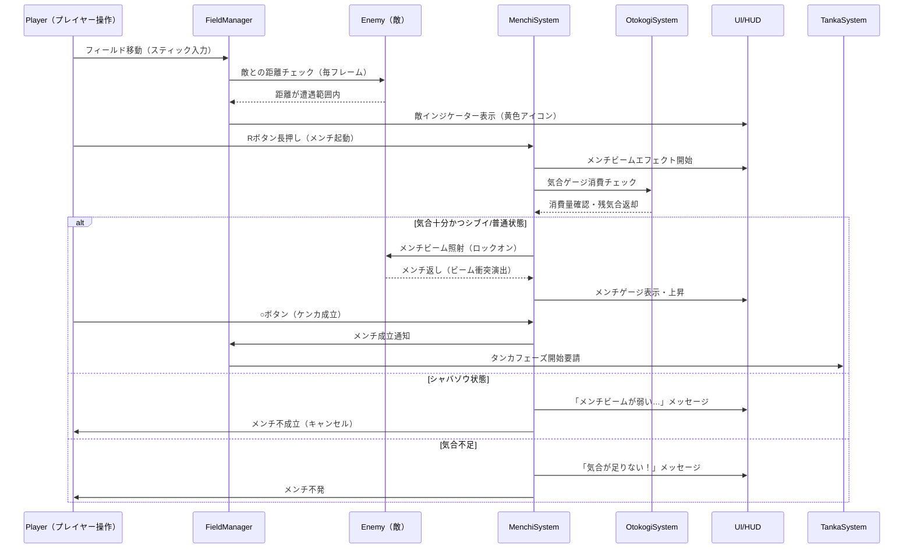
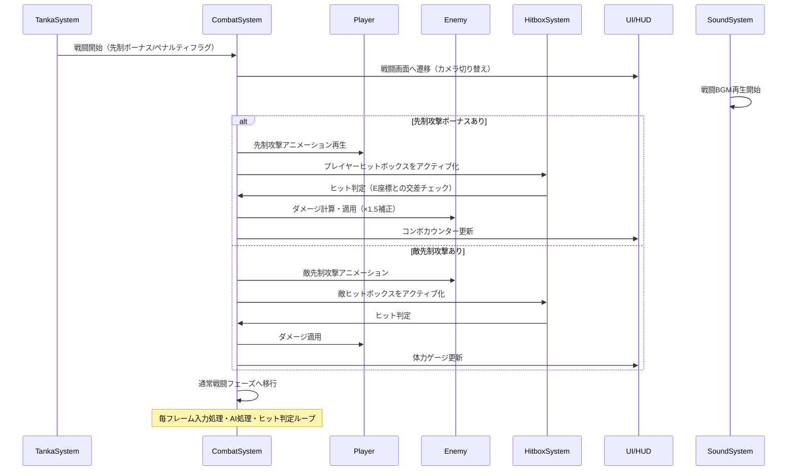
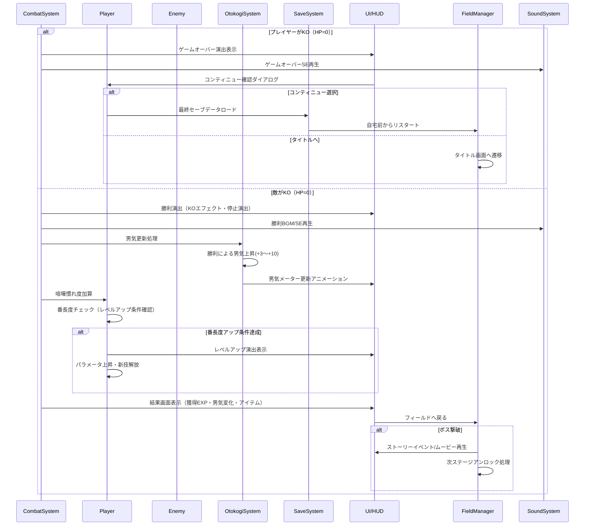

# シーケンス図 — 喧嘩番長

## 1. フィールドでの遭遇〜メンチ開始



---

## 2. メンチ勝利〜タンカ開始

```mermaid
sequenceDiagram
    participant MS as MenchiSystem
    participant TS as TankaSystem
    participant DB as TankaDatabase
    participant P as Player
    participant E as Enemy
    participant UI as UI/HUD
    participant OS as OtokogiSystem

    MS->>TS: タンカ開始要請（メンチ成立通知）
    TS->>DB: タンカスクリプト取得（対象キャラID指定）
    DB-->>TS: TankaScript（セリフ断片・正解ボタン配列）

    TS->>UI: タンカ画面表示
    TS->>UI: セリフ断片をバラバラに配置表示
    TS->>UI: 制限時間タイマー開始

    loop タイマー残時間 > 0
        P->>TS: ボタン入力
        TS->>TS: 入力順序チェック
        alt 正解入力
            TS->>UI: 入力成功フィードバック（光るエフェクト）
            TS->>TS: 次の入力待ち
        else 不正解入力
            TS->>UI: 失敗エフェクト
            TS->>TS: タンカ失敗確定
            break
        end
    end

    alt 全入力成功（タンカ成功）
        TS->>OS: 男気上昇(+5)
        TS->>UI: 「タンカ成功！先制攻撃ボーナス！」表示
        TS->>CombatSystem: 戦闘開始（先制攻撃ボーナスフラグ付き）
    else 裏正解入力成功
        TS->>OS: 男気上昇(+8)
        TS->>UI: 「会心のタンカ！！」特殊演出
        TS->>CombatSystem: 戦闘開始（超強化先制ボーナス）
    else タンカ失敗 or タイムアウト
        TS->>OS: 男気低下(-5)
        TS->>UI: 「タンカ失敗…先制を許した」表示
        TS->>CombatSystem: 戦闘開始（敵先制攻撃フラグ付き）
    end
```

---

## 3. タンカ結果〜戦闘開始



---

## 4. 戦闘終了〜男気更新〜結果画面



---

## シーケンス処理参加者の役割まとめ

| 参加者 | 役割 |
|--------|------|
| Player | プレイヤーの入力・パラメータ保持 |
| Enemy | 敵のAI・行動・パラメータ |
| FieldManager | フィールド全体の管理・遷移制御 |
| MenchiSystem | メンチビーム視線対決のロジック |
| TankaSystem | タンカ入力ゲームのロジック |
| CombatSystem | 戦闘全体の制御・ダメージ計算 |
| HitboxSystem | ヒットボックス衝突判定 |
| OtokogiSystem | 男気パラメータの増減管理 |
| SaveSystem | セーブ・ロード処理 |
| UI/HUD | 画面表示・エフェクト |
| SoundSystem | BGM・SE・ボイスの再生管理 |
