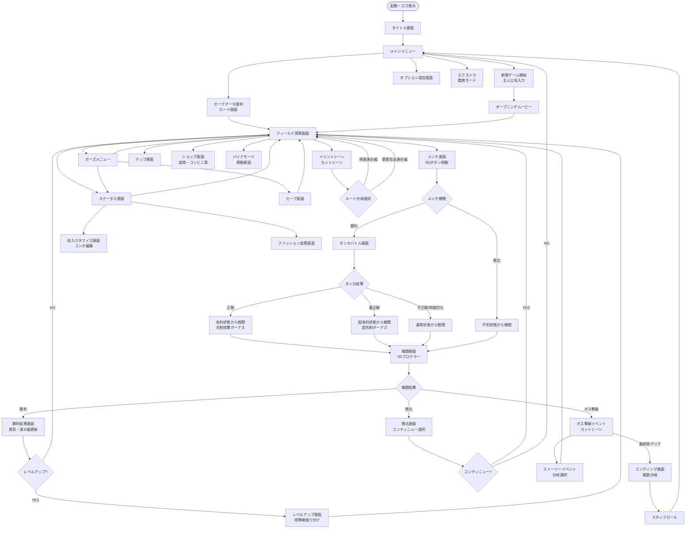

# 画面遷移図 — 喧嘩番長2 Full Throttle

## Mermaid フローチャート

---

## 各画面の説明一覧テーブル

| 画面ID | 画面名 | 概要 | 主な遷移先 |
|--------|--------|------|-----------|
| TITLE | タイトル画面 | ロゴ・キャッチコピー表示。ボタン入力待ち | メインメニュー |
| MAINMENU | メインメニュー | 新規/ロード/オプション/エクストラ選択 | 各種サブ画面 |
| FIELD | フィールド探索 | 3Dマップを自由移動するメイン画面 | メンチ/イベント/各種画面 |
| MENCHI | メンチ画面 | R2でビーム射出、タイミング判定 | タンカ/戦闘 |
| TANKA | タンカバトル | 穴埋め選択式の口頭挑発ミニゲーム | 戦闘 |
| COMBAT | 戦闘画面 | 3Dアクションブロウラー | 勝利結果/敗北画面 |
| RESULT_WIN | 勝利結果画面 | 経験値・男気・習得技の表示 | フィールド/レベルアップ |
| RESULT_LOSE | 敗北画面 | コンティニュー確認 | フィールド/メインメニュー |
| STATUSSCREEN | ステータス画面 | パラメータ・所持技・男気の確認 | 技カスタマイズ/ファッション |
| TECHSCREEN | 技カスタマイズ | 4発コンボの各ヒットに技を割り当て | ステータス画面 |
| SAVESCREEN | セーブ画面 | セーブスロット選択・書き込み | フィールド |
| LEVELUPSCREEN | レベルアップ | 喧嘩魂ポイントを5パラメータに振り分け | フィールド |
| SHOPSCREEN | ショップ | 道場（技購入）・コンビニ（アイテム）等 | フィールド |
| MAPSCREEN | マップ | 全体マップ・現在位置・目的地確認 | フィールド |
| FASHIONSCREEN | ファッション変更 | 上半身インナー・アウター・マスク変更 | ステータス画面 |
| BIKEMODE | バイク移動 | バイク/自転車乗車中の移動画面 | フィールド |
| EVENTSCENE | イベント/カットシーン | ストーリー進行シーン・選択肢 | フィールド/分岐 |
| ENDING | エンディング | ルートと成り上がり度による複数エンディング | スタッフロール |
| OPTIONS | オプション | BGM/SE音量・画面設定等 | メインメニュー |
| EXTRA | エクストラ | クリア後の鑑賞モード・隠しコンテンツ | メインメニュー |
