# クラス図 — 喧嘩番長2 Full Throttle

## Mermaid クラス図

```mermaid
classDiagram
    class GameManager {
        -GameState currentState
        -float deltaTime
        +initialize() void
        +update() void
        +changeState(GameState) void
        +shutdown() void
    }

    class GameState {
        <<enumeration>>
        TITLE
        FIELD
        MENCHI
        TANKA
        COMBAT
        EVENT
        PAUSE
        RESULT
    }

    class Player {
        -int hp
        -int maxHp
        -int kiaiGauge
        -int maxKiai
        -int otokogiScore
        -int kansLevel
        -int kansExp
        -Vector3 position
        -Vector3 rotation
        -MoveSet equippedMoves
        -FashionData fashion
        +move(Vector3 direction) void
        +attack(int moveSlot) void
        +guard() void
        +dodge() void
        +activateSuper() void
        +takeDamage(int amount) void
        +heal(int amount) void
        +gainKansExp(int amount) void
    }

    class Character {
        <<abstract>>
        -String name
        -int hp
        -int maxHp
        -int atkPower
        -int defense
        -int speed
        -int kiaiCapacity
        -AnimationController animCtrl
        +update(float dt) void
        +takeDamage(int damage) void
        +isAlive() bool
        +getPosition() Vector3
    }

    class Enemy {
        -EnemyAI ai
        -EnemyType type
        -int otokogiValue
        -int stageId
        +startMenchi() void
        +selectAttack() MoveData
        +onDefeated() void
    }

    class BossEnemy {
        -int phase
        -int phaseThreshold
        -List~AttackPattern~ patterns
        +updatePhase() void
        +selectBossAttack() MoveData
        +activateSuperMove() void
    }

    class CombatSystem {
        -HitDetector hitDetector
        -ComboManager comboManager
        -HitstopController hitstop
        +startCombat(Player, List~Enemy~) void
        +update(float dt) void
        +checkWinCondition() bool
        +checkLoseCondition() bool
        +applyDamage(Character attacker, Character target, MoveData move) void
        +triggerHitstop(int frames) void
    }

    class HitDetector {
        -List~HitBox~ activeBoxes
        +registerHitBox(HitBox) void
        +checkCollisions() List~HitResult~
        +clearHitBoxes() void
    }

    class ComboManager {
        -int currentHitCount
        -float comboTimer
        -float comboDamageMultiplier
        +addHit() void
        +resetCombo() void
        +getMultiplier() float
        +getCurrentCount() int
    }

    class MenchiSystem {
        -Player player
        -Enemy target
        -float lockProgress
        -MenchiState state
        +startMenchi(Enemy) void
        +update(float dt) void
        +checkInput(InputData) void
        +onWin() void
        +onLose() void
    }

    class TankaSystem {
        -TankaData currentTanka
        -int correctIndex
        -int hiddenCorrectIndex
        -float timeRemaining
        +loadTanka(int tankaId) void
        +update(float dt) void
        +selectAnswer(int index) TankaResult
        +isTimeUp() bool
    }

    class TankaData {
        -String text
        -List~String~ choices
        -int correctAnswerIndex
        -int hiddenAnswerIndex
        -int otokogiBonus
        -int hiddenOtokogiBonus
    }

    class OtokogiSystem {
        -int score
        -int maxScore
        -OtokogiLevel level
        +addScore(int amount, OtokogiEvent event) void
        +subtractScore(int amount, OtokogiEvent event) void
        +getLevel() OtokogiLevel
        +checkEventEffects() void
    }

    class OtokogiLevel {
        <<enumeration>>
        KAN
        KOHA
        NORMAL
        NANNYAKU
        SHABA
    }

    class GrowthSystem {
        -int kansLevel
        -int kansExp
        -int kansPoints
        -ParameterBlock params
        +gainExp(int amount) void
        +levelUp() void
        +assignPoint(ParameterType param, int amount) void
        +checkTechUnlock() List~MoveData~
    }

    class ParameterBlock {
        +int hp
        +int attack
        +int defense
        +int speed
        +int kiaiCapacity
    }

    class StageManager {
        -int currentStageId
        -List~NPC~ activeNPCs
        -AreaData currentArea
        -float gameTime
        +loadStage(int stageId) void
        +unloadStage() void
        +updateTime(float dt) void
        +spawnNPC(NPCData data) NPC
        +checkEventTriggers() void
    }

    class EventSystem {
        -List~int~ clearedFlags
        -List~int~ storyFlags
        -int currentRoute
        +setFlag(int flagId) void
        +checkFlag(int flagId) bool
        +triggerEvent(int eventId) void
        +determineRoute() int
        +calculateEnding() int
    }

    class SaveSystem {
        -MemoryCardInterface mcInterface
        -SaveData currentSave
        +save(int slot) bool
        +load(int slot) bool
        +getSaveInfo(int slot) SaveInfo
        +autoSave() void
    }

    class AssetLoader {
        -DVDInterface dvdInterface
        -AssetCache cache
        +loadAsync(String assetPath) void
        +prefetch(List~String~ paths) void
        +getAsset(String key) Asset
        +evictLRU() void
    }

    class AudioManager {
        -SPU2Interface spu2
        -BGMStream bgmStream
        -List~SESlot~ seSlots
        +playBGM(int bgmId) void
        +stopBGM() void
        +playSE(int seId) void
        +setVolume(float bgmVol, float seVol) void
    }

    class MoveData {
        +int id
        +String name
        +MoveType type
        +int baseDamage
        +int kiaiCost
        +int startupFrames
        +int activeFrames
        +int recoveryFrames
        +String animationKey
    }

    class MoveSet {
        -List~MoveData~ slots
        +equipMove(int slot, MoveData move) void
        +getMove(int slot) MoveData
        +getComboFinisher() MoveData
    }

    %% 継承関係
    Character <|-- Player
    Character <|-- Enemy
    Enemy <|-- BossEnemy

    %% 集約関係
    GameManager *-- CombatSystem
    GameManager *-- MenchiSystem
    GameManager *-- TankaSystem
    GameManager *-- OtokogiSystem
    GameManager *-- GrowthSystem
    GameManager *-- StageManager
    GameManager *-- EventSystem
    GameManager *-- SaveSystem
    GameManager *-- AssetLoader
    GameManager *-- AudioManager

    %% 依存・使用関係
    CombatSystem --> Player
    CombatSystem --> Enemy
    CombatSystem *-- HitDetector
    CombatSystem *-- ComboManager
    MenchiSystem --> Player
    MenchiSystem --> Enemy
    TankaSystem *-- TankaData
    OtokogiSystem -- OtokogiLevel
    GrowthSystem *-- ParameterBlock
    Player *-- MoveSet
    MoveSet *-- MoveData
    GameManager -- GameState
```

---

## クラス間の関係補足

### 継承（Inheritance）
- `Character`（抽象基底）: `Player`と`Enemy`の共通属性（HP・パラメータ・アニメーション）を定義
- `Enemy`→`BossEnemy`: ボスはフェーズ管理と固有攻撃パターンを追加継承

### 集約（Composition）
- `GameManager`は各サブシステムを所有・管理する中央ハブ
- `CombatSystem`は`HitDetector`・`ComboManager`を内包
- `Player`は`MoveSet`を内包し装備技セットを管理

### 依存（Dependency）
- `MenchiSystem`・`CombatSystem`はGameManagerから`Player`と`Enemy`の参照を受け取って操作
- `TankaSystem`は`TankaData`のデータクラスに依存し、選択結果を`OtokogiSystem`に通知

### データフロー
1. `InputManager` → `Player` → `CombatSystem`（入力→アクション→判定）
2. `CombatSystem` → `OtokogiSystem`（戦闘結果→男気更新）
3. `CombatSystem` → `GrowthSystem`（勝利→経験値付与）
4. `EventSystem` → `StageManager`（フラグ変化→NPC配置変更・イベント発火）
