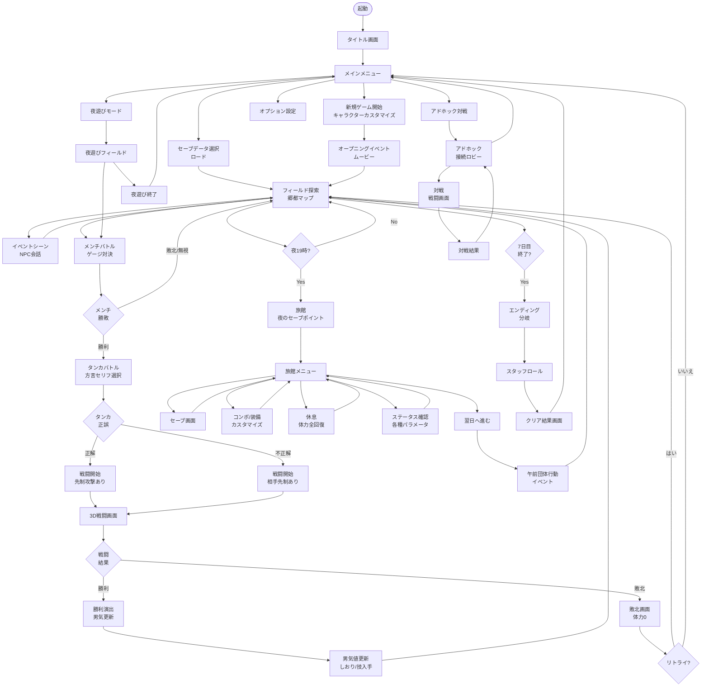

# 画面遷移図 — 喧嘩番長3 全国制覇

## Mermaid フローチャート

---

## 各画面の説明一覧テーブル

| 画面名 | 概要 | 主な入力操作 | 備考 |
|--------|------|------------|------|
| タイトル画面 | ゲームロゴ・キャラ演出・○ボタンで開始 | ○ボタン | デモ演示あり |
| メインメニュー | 新規ゲーム・ロード・夜遊び・対戦・オプション | 十字キー・○ | 最大3スロット |
| キャラクターカスタマイズ | 名前・学校・出身地・外見設定 | 十字キー・○・△ | 初回のみ |
| オープニングイベント | ムービー＋会話演出で郷都到着を描写 | ○でスキップ | スキップ可 |
| フィールド探索 | 郷都の街を3D視点で移動。ミニマップ表示 | スティック・L/R | メインの探索画面 |
| イベントシーン | NPC会話・物語進行のカットシーン | ○で進める | 分岐選択あり |
| メンチバトル | 視線ゲージを押し込む入力対決 | □連打orタイミング入力 | 制限時間あり |
| タンカバトル | 方言セリフの返答を2〜3択で選ぶ | 十字キー・○ | 正誤で先制決定 |
| 3D戦闘画面 | ビートアップアクション戦闘 | □△○×・L/R | 本作のコアプレイ |
| 勝利演出・男気更新 | 勝利ポーズ・男気変動・アイテム取得表示 | ○で確認 | — |
| 敗北画面 | HP0時の演出、リトライ選択 | ○・× | — |
| 旅館メニュー | セーブ・休息・カスタマイズへの分岐 | 十字キー・○ | 夜のハブ画面 |
| セーブ画面 | スロット選択して保存 | 十字キー・○ | 3スロット |
| ステータス画面 | HP・攻防力・男気・喧嘩魂・制覇数確認 | 十字キー | 詳細確認用 |
| コンボカスタマイズ | 技の順序入れ替え・地元スペシャル設定 | 十字キー・○・△ | — |
| エンディング | 制覇数・ヒロイン親密度で分岐 | ○ | 複数パターン |
| クリア結果画面 | 制覇数・プレイ時間・男気最高値などを表示 | ○ | 周回への誘導 |
| 夜遊びモードフィールド | メインと同一マップ。制限なし戦闘 | — | セーブ不可 |
| アドホック接続ロビー | 近距離PSP間の接続を待機 | — | 1対1対戦のみ |
| アドホック対戦 | 対人戦闘。メインモードと同一戦闘システム | — | ローカル通信 |
| オプション設定 | 音量・操作設定・画面輝度など | 十字キー・○ | — |
