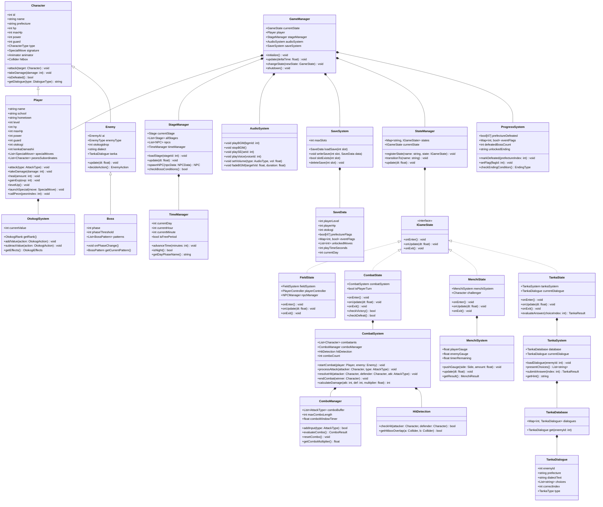

# クラス図 — 喧嘩番長3 全国制覇

## Mermaid classDiagram

---

## クラス間の関係説明

| 関係 | クラスA | クラスB | 説明 |
|------|---------|---------|------|
| 継承 | Player | Character | プレイヤーはキャラクターの特殊化 |
| 継承 | Enemy | Character | 敵もキャラクターの特殊化 |
| 継承 | Boss | Enemy | ボスは敵の特殊化（フェーズ管理追加） |
| 実装 | FieldState | IGameState | フィールドステートはインターフェース実装 |
| 実装 | CombatState | IGameState | 戦闘ステートはインターフェース実装 |
| 集約 | GameManager | Player | ゲーム全体でプレイヤーを管理 |
| 集約 | CombatSystem | ComboManager | 戦闘システムがコンボ管理を内包 |
| 依存 | TankaSystem | TankaDatabase | タンカシステムはDBからデータ取得 |
| 依存 | ProgressSystem | SaveData | 進行状況はセーブデータに保存される |
