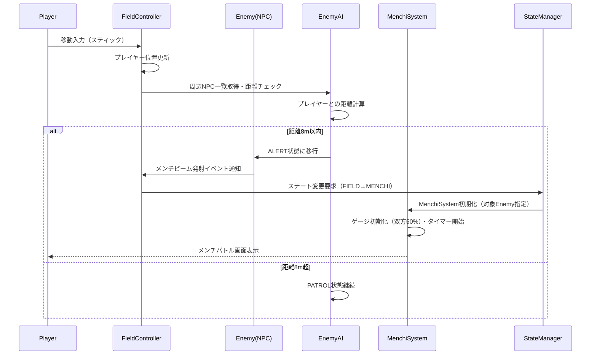
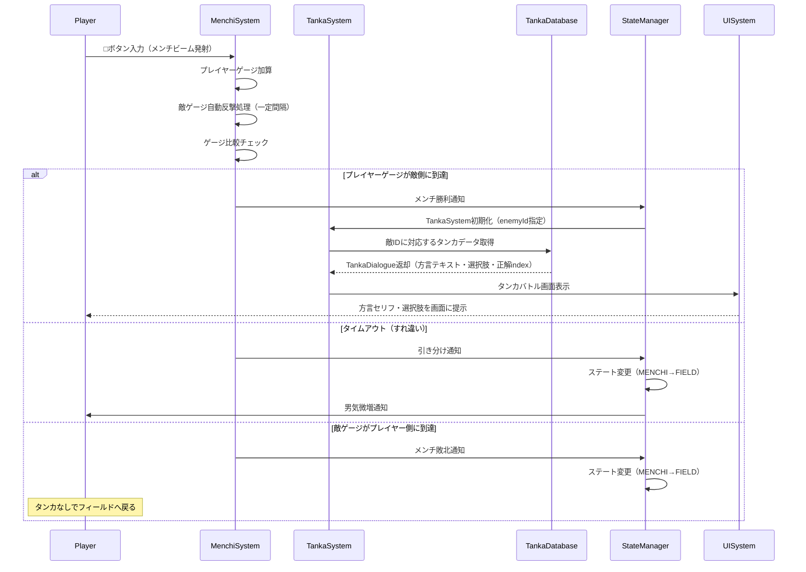
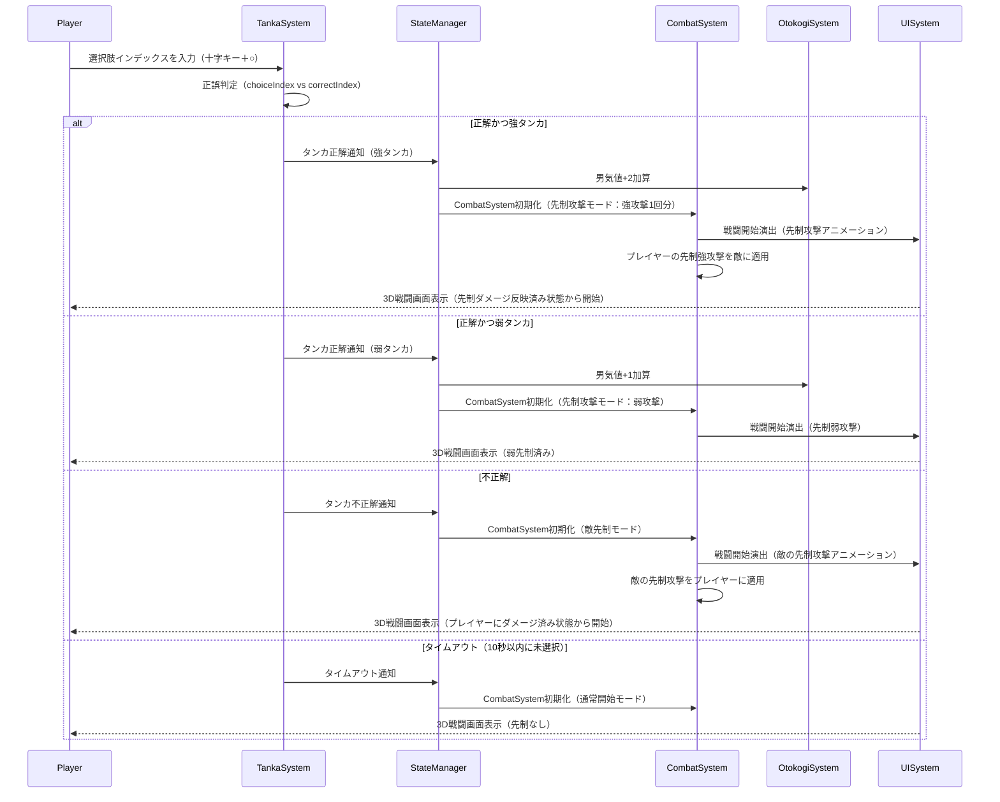
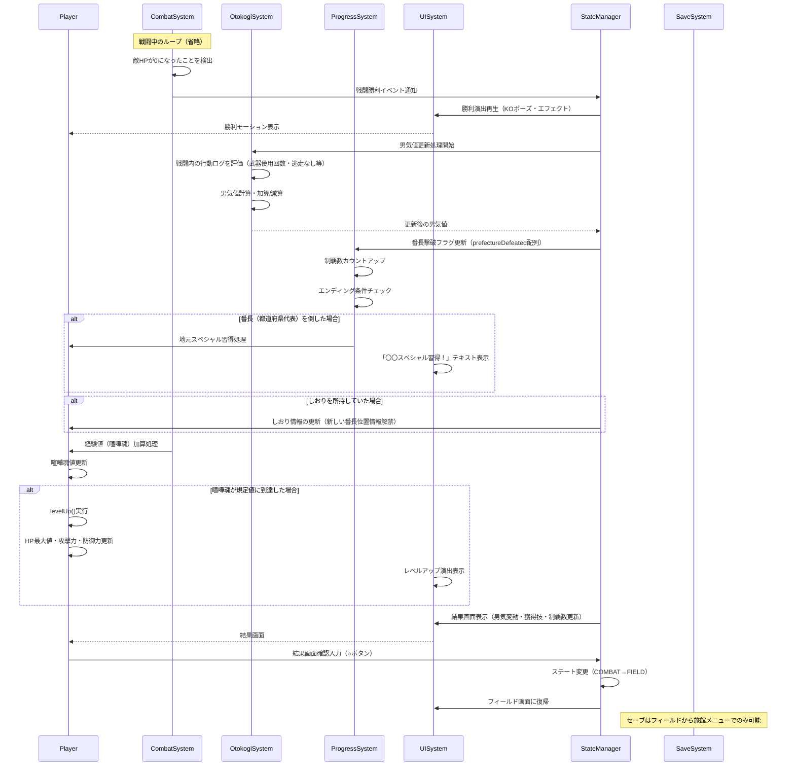

# シーケンス図 — 喧嘩番長3 全国制覇

## シーケンス1：フィールドでの遭遇〜メンチ開始

```mermaid
sequenceDiagram
    participant P as Player
    participant FC as FieldController
    participant NPC as Enemy(NPC)
    participant AI as EnemyAI
    participant MS as MenchiSystem
    participant SM as StateManager

    P->>FC: 移動入力（スティック）
    FC->>FC: プレイヤー位置更新
    FC->>AI: 周辺NPC一覧取得・距離チェック
    AI->>AI: プレイヤーとの距離計算
    alt 距離8m以内
        AI->>NPC: ALERT状態に移行
        NPC->>FC: メンチビーム発射イベント通知
        FC->>SM: ステート変更要求（FIELD→MENCHI）
        SM->>MS: MenchiSystem初期化（対象Enemy指定）
        MS->>MS: ゲージ初期化（双方50%）・タイマー開始
        MS-->>P: メンチバトル画面表示
    else 距離8m超
        AI->>AI: PATROL状態継続
    end
```

---

## シーケンス2：メンチ勝利〜タンカ開始

```mermaid
sequenceDiagram
    participant P as Player
    participant MS as MenchiSystem
    participant TS as TankaSystem
    participant TDB as TankaDatabase
    participant SM as StateManager
    participant UI as UISystem

    P->>MS: □ボタン入力（メンチビーム発射）
    MS->>MS: プレイヤーゲージ加算
    MS->>MS: 敵ゲージ自動反撃処理（一定間隔）
    MS->>MS: ゲージ比較チェック

    alt プレイヤーゲージが敵側に到達
        MS->>SM: メンチ勝利通知
        SM->>TS: TankaSystem初期化（enemyId指定）
        TS->>TDB: 敵IDに対応するタンカデータ取得
        TDB-->>TS: TankaDialogue返却（方言テキスト・選択肢・正解index）
        TS->>UI: タンカバトル画面表示
        UI-->>P: 方言セリフ・選択肢を画面に提示
    else タイムアウト（すれ違い）
        MS->>SM: 引き分け通知
        SM->>SM: ステート変更（MENCHI→FIELD）
        SM->>P: 男気微増通知
    else 敵ゲージがプレイヤー側に到達
        MS->>SM: メンチ敗北通知
        SM->>SM: ステート変更（MENCHI→FIELD）
        note over P: タンカなしでフィールドへ戻る
    end
```

---

## シーケンス3：タンカ結果〜戦闘開始

```mermaid
sequenceDiagram
    participant P as Player
    participant TS as TankaSystem
    participant SM as StateManager
    participant CS as CombatSystem
    participant OS as OtokogiSystem
    participant UI as UISystem

    P->>TS: 選択肢インデックスを入力（十字キー＋○）
    TS->>TS: 正誤判定（choiceIndex vs correctIndex）

    alt 正解かつ強タンカ
        TS->>SM: タンカ正解通知（強タンカ）
        SM->>OS: 男気値+2加算
        SM->>CS: CombatSystem初期化（先制攻撃モード：強攻撃1回分）
        CS->>UI: 戦闘開始演出（先制攻撃アニメーション）
        CS->>CS: プレイヤーの先制強攻撃を敵に適用
        UI-->>P: 3D戦闘画面表示（先制ダメージ反映済み状態から開始）

    else 正解かつ弱タンカ
        TS->>SM: タンカ正解通知（弱タンカ）
        SM->>OS: 男気値+1加算
        SM->>CS: CombatSystem初期化（先制攻撃モード：弱攻撃）
        CS->>UI: 戦闘開始演出（先制弱攻撃）
        UI-->>P: 3D戦闘画面表示（弱先制済み）

    else 不正解
        TS->>SM: タンカ不正解通知
        SM->>CS: CombatSystem初期化（敵先制モード）
        CS->>UI: 戦闘開始演出（敵の先制攻撃アニメーション）
        CS->>CS: 敵の先制攻撃をプレイヤーに適用
        UI-->>P: 3D戦闘画面表示（プレイヤーにダメージ済み状態から開始）

    else タイムアウト（10秒以内に未選択）
        TS->>SM: タイムアウト通知
        SM->>CS: CombatSystem初期化（通常開始モード）
        UI-->>P: 3D戦闘画面表示（先制なし）
    end
```

---

## シーケンス4：戦闘終了〜男気更新〜結果画面

```mermaid
sequenceDiagram
    participant P as Player
    participant CS as CombatSystem
    participant OS as OtokogiSystem
    participant PS as ProgressSystem
    participant UI as UISystem
    participant SM as StateManager
    participant SS as SaveSystem

    note over CS: 戦闘中のループ（省略）

    CS->>CS: 敵HPが0になったことを検出
    CS->>SM: 戦闘勝利イベント通知

    SM->>UI: 勝利演出再生（KOポーズ・エフェクト）
    UI-->>P: 勝利モーション表示

    SM->>OS: 男気値更新処理開始
    OS->>OS: 戦闘内の行動ログを評価（武器使用回数・逃走なし等）
    OS->>OS: 男気値計算・加算/減算
    OS-->>SM: 更新後の男気値

    SM->>PS: 番長撃破フラグ更新（prefectureDefeated配列）
    PS->>PS: 制覇数カウントアップ
    PS->>PS: エンディング条件チェック

    alt 番長（都道府県代表）を倒した場合
        PS->>P: 地元スペシャル習得処理
        UI->>UI: 「〇〇スペシャル習得！」テキスト表示
    end

    alt しおりを所持していた場合
        SM->>P: しおり情報の更新（新しい番長位置情報解禁）
    end

    CS->>P: 経験値（喧嘩魂）加算処理
    P->>P: 喧嘩魂値更新

    alt 喧嘩魂が規定値に到達した場合
        P->>P: levelUp()実行
        P->>P: HP最大値・攻撃力・防御力更新
        UI->>UI: レベルアップ演出表示
    end

    SM->>UI: 結果画面表示（男気変動・獲得技・制覇数更新）
    UI-->>P: 結果画面

    P->>SM: 結果画面確認入力（○ボタン）
    SM->>SM: ステート変更（COMBAT→FIELD）
    SM->>UI: フィールド画面に復帰

    note over SS: セーブはフィールドから旅館メニューでのみ可能
```
