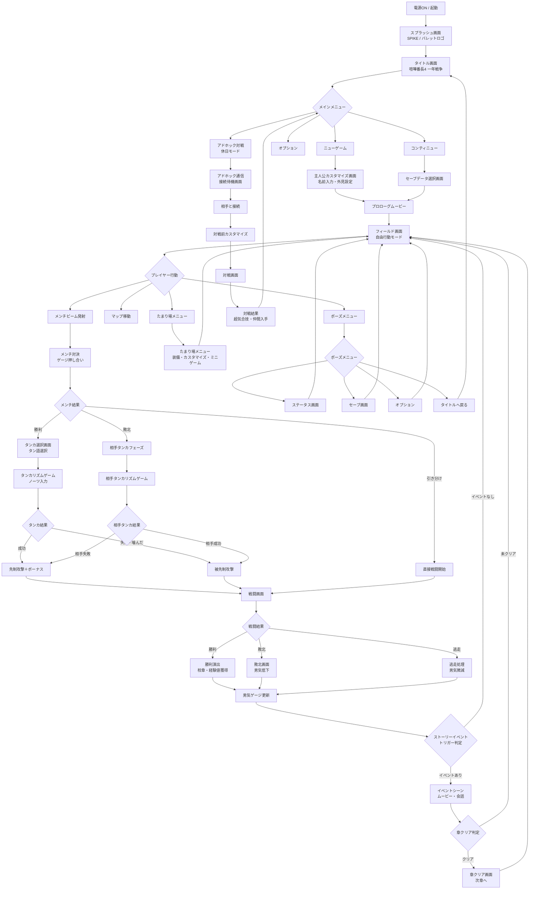

# 画面遷移図 — 喧嘩番長4

## フローチャート（Mermaid）

---

## 各画面の説明一覧

| 画面名 | 説明 | 前の画面 | 次の画面 | 備考 |
|-------|------|---------|---------|------|
| タイトル画面 | ゲームタイトルロゴ・テーマ曲再生。ボタン入力待ち。 | スプラッシュ | メインメニュー | 任意ボタン押しで遷移 |
| メインメニュー | ニューゲーム・コンティニュー・オプション・アドホック選択 | タイトル | 各サブ画面 | ニューゲームは初回のみ選択可 |
| キャラクターカスタマイズ | 主人公の名前・髪型・髪色・服装を設定 | ニューゲーム選択後 | プロローグムービー | 後でたまり場でも変更可能 |
| セーブデータ選択 | 3スロットのセーブデータ選択 | コンティニュー選択後 | フィールド画面 | セーブデータのプレビュー表示あり |
| プロローグムービー | 阿久津の噂を聞いて入学を決意する導入ムービー | カスタマイズ完了 | フィールド画面 | スキップ可能 |
| フィールド画面 | メインのゲームプレイ画面。3Dマップ上を自由行動 | 各画面から戻る | メンチ・たまり場・ポーズ | ミニマップ常時表示 |
| メンチ対決画面 | 眼力ゲージ押し合い。メンチビームエフェクト表示 | フィールド（敵接触） | タンカ選択画面 | 制限時間あり |
| タンカ選択画面 | 登録済みタンカ4種から選択する画面 | メンチ勝利 | タンカリズム画面 | 制限時間5秒 |
| タンカリズム画面 | ビートに合わせてノーツを入力するリズムゲーム | タンカ選択完了 | 戦闘画面（先制判定） | PERFECT/GREAT/GOOD/MISS判定 |
| 戦闘画面 | 3Dアクション戦闘。体力バー・気合ゲージ表示 | タンカ結果後 | 勝利/敗北/逃走画面 | 複数人同時戦闘対応 |
| 勝利画面 | 校章・経験値・男気上昇演出 | 戦闘勝利 | フィールド（戻る） | 光る校章は条件達成時のみ |
| ステータス画面 | プレイヤーパラメータ・校章一覧・武勇伝表示 | ポーズメニュー | フィールド（戻る） | 学生名簿・超気合技一覧も確認可 |
| セーブ画面 | 3スロットへのセーブ操作 | ポーズメニュー・たまり場 | フィールド（戻る） | オートセーブ機能なし |
| たまり場メニュー | 装備変更・カスタマイズ・麻雀等ミニゲーム | フィールド（たまり場侵入） | フィールド（戻る） | 占領した拠点でのみ利用可 |
| アドホック接続画面 | 近距離無線通信で相手プレイヤーと接続 | メインメニュー | 対戦カスタマイズ | クリア後解放 |
| 対戦画面 | アドホック1対1リアルタイム対戦 | アドホック接続完了 | 対戦結果画面 | 全国47都道府県番長が相手 |
