# クラス図 — 喧嘩番長4

## 主要クラス図（Mermaid）

```mermaid
classDiagram
    class GameManager {
        +SceneType currentScene
        +GameState state
        +init() void
        +update(dt: float) void
        +changeScene(SceneType) void
        +saveGame(slot: int) void
        +loadGame(slot: int) void
    }

    class Player {
        +string name
        +int hp
        +int maxHp
        +int kiaiGauge
        +PlayerStats stats
        +CharacterAppearance appearance
        +List~MoveData~ equippedMoves
        +List~ChokoshoData~ collectedChokosho
        +OtokogiRank otokogiRank
        +move(direction: Vector2) void
        +attack(type: AttackType) void
        +guard() void
        +fireMenuchi() void
        +chargeUltra() void
        +activateUltra(moveId: int) void
        +takeDamage(amount: int) void
        +heal(amount: int) void
    }

    class PlayerStats {
        +int level
        +int exp
        +int power
        +int vitality
        +int eyePower
        +int lungCapacity
        +int speed
        +int guts
        +int oralSkill
        +addExp(amount: int) void
        +levelUp() void
        +toNextLevel() int
    }

    class Enemy {
        +string name
        +int classId
        +int hp
        +int maxHp
        +EnemyStats stats
        +AIState currentAIState
        +MoveData ultraMove
        +List~MoveData~ moveList
        +attack() void
        +guard() void
        +activateUltra() void
        +takeDamage(amount: int) void
        +onDefeated() void
    }

    class EnemyStats {
        +int power
        +int vitality
        +int eyePower
        +int guardStrength
        +int attackInterval
        +float ultraTriggerHP
    }

    class CombatSystem {
        +Player player
        +List~Enemy~ enemies
        +CombatPhase phase
        +int comboCount
        +float hitstopTimer
        +startCombat(Player, List~Enemy~) void
        +update(dt: float) void
        +processAttack(attacker, target, MoveData) void
        +calculateDamage(attacker, target, MoveData) int
        +checkCombo() void
        +applyHitstop(duration: float) void
        +endCombat(result: CombatResult) void
    }

    class MoveData {
        +int id
        +string name
        +MoveType type
        +float powerCoeff
        +int kiaiCost
        +int frameStartup
        +int frameActive
        +int frameRecovery
        +bool isUltra
        +int ultraLevel
        +bool isGuardBreak
    }

    class MenchiSystem {
        +Player player
        +Enemy target
        +MenchiPhase phase
        +float playerGauge
        +float enemyGauge
        +startMenchi(Player, Enemy) void
        +update(dt: float) void
        +onButtonPress() void
        +calculateResult() MenchiResult
        +collectTanGo(spotId: int) TanGoData
    }

    class TankaSystem {
        +List~TanGoData~ registeredTanGo
        +TanGoData selectedTanGo
        +List~NoteData~ noteSequence
        +int perfectCount
        +int goodCount
        +int missCount
        +float bpm
        +startTanka(TanGoData) void
        +update(dt: float) void
        +onButtonInput(ButtonType) void
        +judgeNote(NoteData, float timing) NoteJudge
        +calculateBonus() int
        +registerTanGo(button: ButtonType, tanGo: TanGoData) void
    }

    class TanGoData {
        +int id
        +string text
        +List~NoteData~ notes
        +int difficulty
        +int successBonus
    }

    class OtokogiSystem {
        +float otokogiValue
        +OtokogiRank currentRank
        +addOtokogi(amount: float, reason: OtokogiEvent) void
        +subtractOtokogi(amount: float, reason: OtokogiEvent) void
        +updateRank() void
        +isShaBazo() bool
        +canGetShiningChokosho() bool
    }

    class StageManager {
        +int currentChapterId
        +int currentMonthId
        +List~StageData~ stages
        +Map~int, bool~ clearedStages
        +StageData currentStage
        +loadStage(stageId: int) void
        +unloadStage() void
        +checkStageComplete() bool
        +advanceChapter() void
        +getAvailableEnemies() List~Enemy~
    }

    class StageData {
        +int id
        +string name
        +string location
        +int chapterId
        +int bossId
        +string bgmId
        +List~int~ enemyIds
        +Vector3 playerStartPos
    }

    class UIManager {
        +HUD hud
        +MenchiUI menchiUI
        +TankaUI tankaUI
        +CombatUI combatUI
        +StatusScreen statusScreen
        +update() void
        +showHUD() void
        +hideHUD() void
        +showCombatUI(Player, Enemy) void
        +showMenchiUI() void
        +showTankaUI() void
        +showStatusScreen() void
    }

    class SaveSystem {
        +int maxSlots
        +SaveData loadSave(slot: int) SaveData
        +void writeSave(slot: int, SaveData) void
        +bool slotExists(slot: int) bool
        +deleteSave(slot: int) void
    }

    class SaveData {
        +string playerName
        +PlayerStats stats
        +CharacterAppearance appearance
        +int currentChapterId
        +int currentMonthId
        +float otokogiValue
        +List~int~ collectedChokoshoIds
        +List~int~ learnedMoveIds
        +List~int~ alliedBossIds
        +Map~string, bool~ storyFlags
        +List~TanGoData~ registeredTanGo
        +int playTimeSeconds
    }

    class AudioManager {
        +string currentBGMId
        +float bgmVolume
        +float seVolume
        +playBGM(bgmId: string, loop: bool) void
        +stopBGM(fadeOut: float) void
        +playSE(seId: string) void
        +playVoice(voiceId: string) void
        +setVolume(bgm: float, se: float) void
    }

    class CharacterAppearance {
        +int hairStyleId
        +int hairColorId
        +int uniformTopId
        +int uniformBottomId
        +int accessoryId
        +int walkMotionId
    }

    %% 継承関係
    Player --|> Character
    Enemy --|> Character

    %% 集約関係
    GameManager *-- StageManager
    GameManager *-- UIManager
    GameManager *-- SaveSystem
    GameManager *-- AudioManager
    GameManager *-- CombatSystem
    GameManager *-- MenchiSystem
    GameManager *-- TankaSystem
    GameManager *-- OtokogiSystem

    Player *-- PlayerStats
    Player *-- CharacterAppearance
    Enemy *-- EnemyStats

    CombatSystem o-- Player
    CombatSystem o-- Enemy
    CombatSystem o-- MoveData

    MenchiSystem o-- Player
    MenchiSystem o-- Enemy

    TankaSystem o-- TanGoData

    StageManager *-- StageData

    SaveSystem *-- SaveData
```

---

## クラス間の関係補足説明

| 関係 | クラスA | クラスB | 関係の種類 | 説明 |
|-----|--------|--------|----------|------|
| GameManager → StageManager | 所有（コンポジション） | GameManagerがStageManagerの生死を管理 |
| Player → PlayerStats | 所有（コンポジション） | Playerに必ずPlayerStatsが存在する |
| CombatSystem → Player/Enemy | 関連（集約） | CombatSystemはPlayer/Enemyの参照を持つが生死は管理しない |
| Player/Enemy → Character | 継承 | 共通の基底クラスCharacterを継承する |
| TankaSystem → TanGoData | 依存 | TankaSystemはTanGoDataを一時的に使用する |
