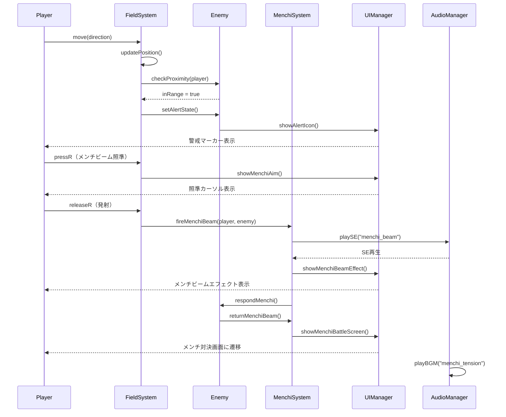
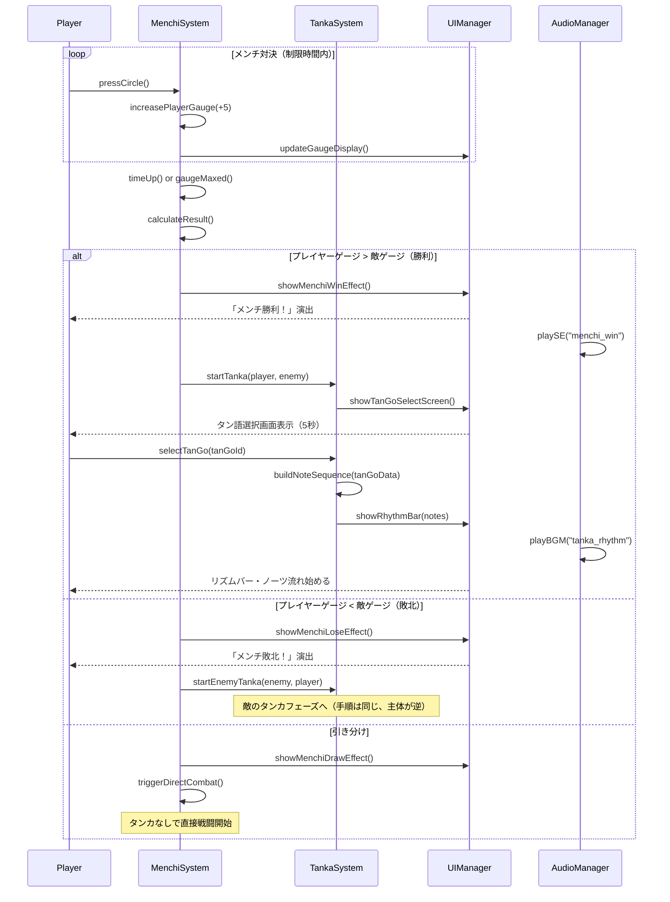
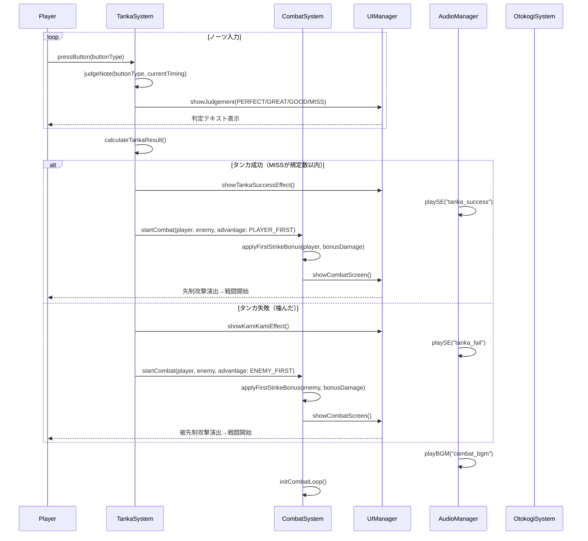
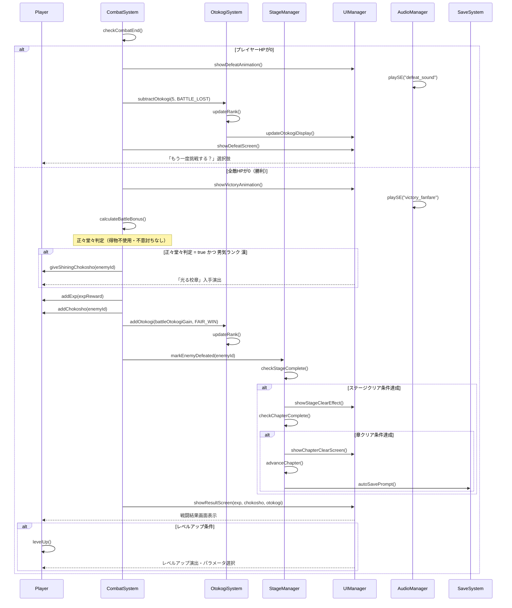

# シーケンス図 — 喧嘩番長4

## 1. フィールドでの遭遇〜メンチ開始

---

## 2. メンチ勝利〜タンカ開始

---

## 3. タンカ結果〜戦闘開始

---

## 4. 戦闘終了〜男気更新〜結果画面

---

## シーケンス処理参加者まとめ

| 参加者 | 役割 |
|-------|------|
| Player (P) | プレイヤーキャラクター。入力を受け取り行動する |
| FieldSystem (FS) | フィールド探索・NPCとの接触判定を管理 |
| Enemy (E) | 敵キャラクター。AI行動・反応を担う |
| MenchiSystem (MS) | メンチビーム発射〜メンチ対決の処理を管理 |
| TankaSystem (TS) | タン語選択・リズムゲーム・判定処理を管理 |
| CombatSystem (CS) | 実際の戦闘処理・ダメージ計算・勝敗判定を担う |
| OtokogiSystem (OS) | 男気ゲージの増減・ランク更新を管理 |
| StageManager (SS) | ステージ進行・章管理・クリア条件判定を担う |
| UIManager (UI) | 全画面の表示更新・演出制御を担う |
| AudioManager (Audio) | BGM・SE・ボイスの再生制御を担う |
| SaveSystem (Save) | セーブデータの読み書きを担う |
