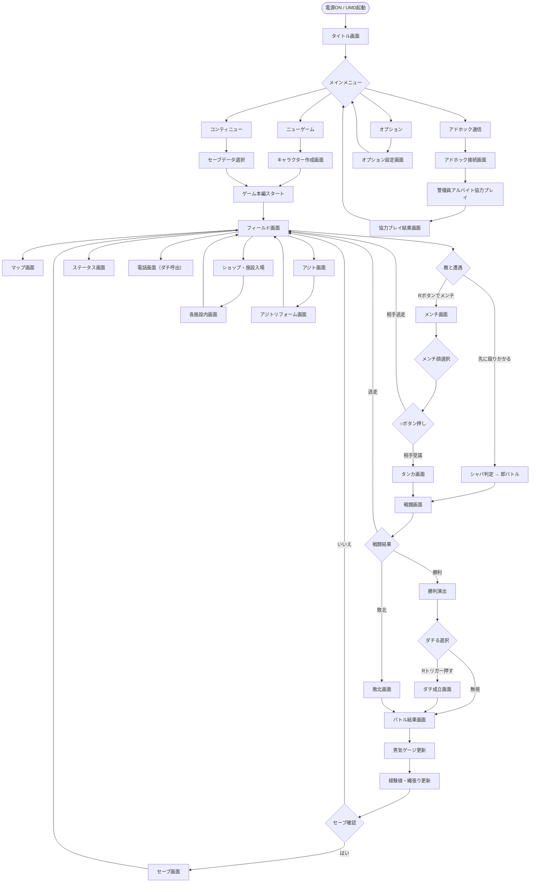

# 画面遷移図 — 喧嘩番長5 漢の法則

## メイン画面フロー

---

## 各画面の説明一覧

| 画面名 | 画面ID | 概要 | 遷移元 | 遷移先 |
|---|---|---|---|---|
| タイトル画面 | SCR_TITLE | ゲームタイトルロゴ表示。ボタン押下待機 | 電源ON | メインメニュー |
| メインメニュー | SCR_MENU | ニューゲーム・コンティニュー・オプション・アドホックの選択肢 | タイトル / ゲーム中ポーズ | 各選択先 |
| キャラクター作成 | SCR_CREATE | 名前・髪型・服装・所属高校名を設定 | ニューゲーム選択時 | フィールド画面 |
| セーブデータ選択 | SCR_SAVE_SEL | 最大3スロットのセーブデータ一覧表示 | コンティニュー選択時 | フィールド画面 |
| フィールド画面 | SCR_FIELD | ゲームのメイン画面。キャラ移動・施設入場・会話 | ゲーム本編全般 | メンチ・施設・マップ等 |
| マップ画面 | SCR_MAP | 阿弥浜沿線の縄張りマップ表示。未制覇は赤表示 | フィールド中SELECT | フィールド |
| アジト画面 | SCR_AJITO | アジト内のキャラ一覧・家具配置 | フィールド（アジト付近） | リフォーム画面・フィールド |
| アジトリフォーム | SCR_REFORM | 家具・オブジェクトの自由配置画面 | アジト画面 | アジト画面 |
| ステータス画面 | SCR_STATUS | 主人公パラメータ・技一覧・男気ゲージ確認 | フィールド（STARTボタン） | フィールド |
| 電話画面 | SCR_PHONE | ダチリストから集団喧嘩要員を呼び出す | フィールド（L+○） | フィールド |
| メンチ画面 | SCR_MENCHI | 顔選択・ゲージ対決・相手の反応表示 | フィールドで敵遭遇 | タンカ画面 or フィールド |
| タンカ画面 | SCR_TANKA | セリフ断片の落下入力ゲーム | メンチ成立後 | 戦闘画面 |
| 戦闘画面 | SCR_BATTLE | アイコン落下式の攻撃入力バトル本編 | タンカ後 / 即バトル | 勝利演出 or 敗北画面 |
| 勝利演出 | SCR_WIN | ノックアウト演出・勝利台詞 | 戦闘勝利時 | ダチ選択 or 結果画面 |
| 敗北画面 | SCR_LOSE | 主人公が倒れる演出・コンティニュー確認 | 戦闘敗北時 | コンティニュー or タイトル |
| バトル結果画面 | SCR_RESULT | 獲得経験値・男気変動・縄張り変化の確認 | 戦闘終了後 | フィールド |
| ダチ成立画面 | SCR_DACHI | 手を差し伸べる演出・友人登録確認 | 勝利後Rトリガー | バトル結果画面 |
| セーブ画面 | SCR_SAVE | セーブスロット選択・確認ダイアログ | バトル結果後・任意 | フィールド |
| オプション画面 | SCR_OPTION | BGM/SE音量・文字サイズ・コントロール設定 | メインメニュー | メインメニュー |
| 施設画面群 | SCR_SHOP_* | ショップ・ゲーセン・食堂等の専用UI | フィールドから入場 | フィールド |
| アドホック接続 | SCR_ADHOC | PSPアドホック接続手順・ルーム選択 | メインメニュー | 協力プレイ |
| 協力プレイ画面 | SCR_COOP | 警備員アルバイトの2人協力画面 | アドホック接続後 | 協力結果画面 |
