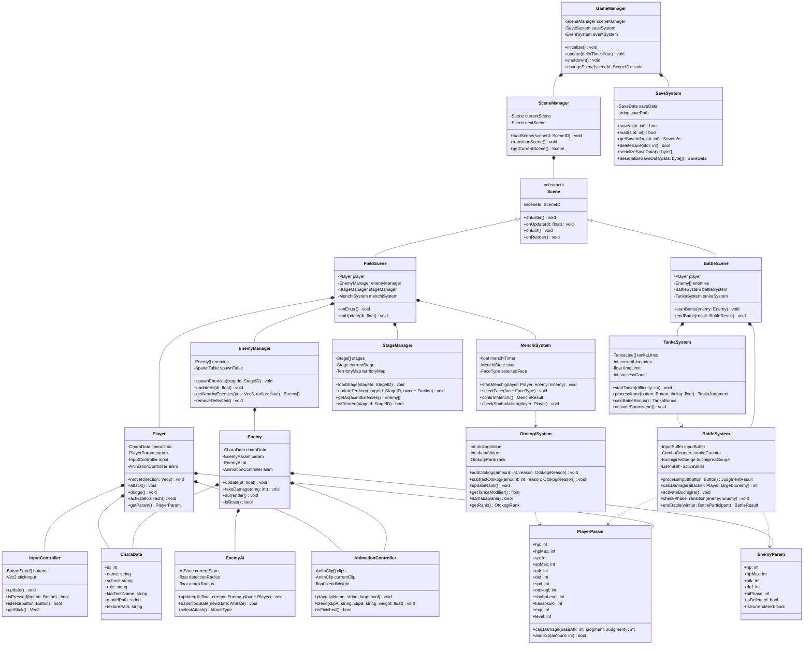
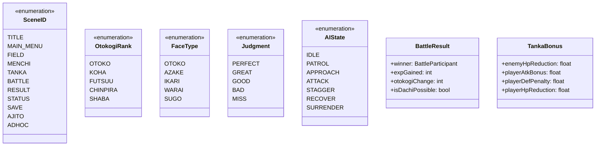

# クラス図 — 喧嘩番長5 漢の法則

## メインクラス図

```mermaid
classDiagram
    class GameManager {
        -SceneManager sceneManager
        -SaveSystem saveSystem
        -EventSystem eventSystem
        +initialize() void
        +update(deltaTime: float) void
        +shutdown() void
        +changeScene(sceneId: SceneID) void
    }

    class SceneManager {
        -Scene currentScene
        -Scene nextScene
        +loadScene(sceneId: SceneID) void
        +transitionScene() void
        +getCurrentScene() Scene
    }

    class Scene {
        <<abstract>>
        #sceneId: SceneID
        +onEnter() void
        +onUpdate(dt: float) void
        +onExit() void
        +onRender() void
    }

    class FieldScene {
        -Player player
        -EnemyManager enemyManager
        -StageManager stageManager
        -MenchiSystem menchiSystem
        +onEnter() void
        +onUpdate(dt: float) void
    }

    class BattleScene {
        -Player player
        -Enemy[] enemies
        -BattleSystem battleSystem
        -TankaSystem tankaSystem
        +startBattle(enemy: Enemy) void
        +endBattle(result: BattleResult) void
    }

    class Player {
        -CharaData charaData
        -PlayerParam param
        -InputController input
        -AnimationController anim
        +move(direction: Vec2) void
        +attack() void
        +dodge() void
        +activateKiaiTech() void
        +getParam() PlayerParam
    }

    class Enemy {
        -CharaData charaData
        -EnemyParam param
        -EnemyAI ai
        -AnimationController anim
        +update(dt: float) void
        +takeDamage(dmg: int) void
        +surrender() void
        +isBoss() bool
    }

    class CharaData {
        +id: int
        +name: string
        +school: string
        +role: string
        +kiaiTechName: string
        +modelPath: string
        +texturePath: string
    }

    class PlayerParam {
        +hp: int
        +hpMax: int
        +sp: int
        +spMax: int
        +atk: int
        +def: int
        +spd: int
        +otokogi: int
        +shabaLevel: int
        +kansokuKi: int
        +exp: int
        +level: int
        +calcDamage(baseAtk: int, judgment: Judgment) int
        +addExp(amount: int) bool
    }

    class EnemyParam {
        +hp: int
        +hpMax: int
        +atk: int
        +def: int
        +aiPhase: int
        +isDefeated: bool
        +isSurrendered: bool
    }

    class BattleSystem {
        -InputBuffer inputBuffer
        -ComboCounter comboCounter
        -BuchigireaGauge buchigireaGauge
        -List~Skill~ activeSkills
        +processInput(button: Button) JudgmentResult
        +calcDamage(attacker: Player, target: Enemy) int
        +activateBuchigire() void
        +checkPhaseTransition(enemy: Enemy) void
        +endBattle(winner: BattleParticipant) BattleResult
    }

    class MenchiSystem {
        -float menchiTimer
        -MenchiState state
        -FaceType selectedFace
        +startMenchi(player: Player, enemy: Enemy) void
        +selectFace(face: FaceType) void
        +confirmMenchi() MenchiResult
        +checkShabaAction(player: Player) void
    }

    class TankaSystem {
        -TankaLine[] tankaLines
        -int currentLineIndex
        -float timeLimit
        -int successCount
        +startTanka(difficulty: int) void
        +processInput(button: Button, timing: float) TankaJudgment
        +calcBattleBonus() TankaBonus
        +activateShamisene() void
    }

    class OtokogiSystem {
        -int otokogiValue
        -int shabaValue
        -OtokogiRank rank
        +addOtokogi(amount: int, reason: OtokogiReason) void
        +subtractOtokogi(amount: int, reason: OtokogiReason) void
        +updateRank() void
        +getTankaModifier() float
        +isShabaGami() bool
        +getRank() OtokogiRank
    }

    class StageManager {
        -Stage[] stages
        -Stage currentStage
        -TerritoryMap territoryMap
        +loadStage(stageId: StageID) void
        +updateTerritory(stageId: StageID, owner: Faction) void
        +getAdjacentEnemies() Enemy[]
        +isCleared(stageId: StageID) bool
    }

    class SaveSystem {
        -SaveData saveData
        -string savePath
        +save(slot: int) bool
        +load(slot: int) bool
        +getSaveInfo(slot: int) SaveInfo
        +deleteSave(slot: int) bool
        +serializeSaveData() byte[]
        +deserializeSaveData(data: byte[]) SaveData
    }

    class EnemyManager {
        -Enemy[] enemies
        -SpawnTable spawnTable
        +spawnEnemies(stageId: StageID) void
        +updateAll(dt: float) void
        +getNearbyEnemies(pos: Vec3, radius: float) Enemy[]
        +removeDefeated() void
    }

    class EnemyAI {
        -AIState currentState
        -float detectionRadius
        -float attackRadius
        +update(dt: float, enemy: Enemy, player: Player) void
        +transitionState(newState: AIState) void
        +selectAttack() AttackType
    }

    class AnimationController {
        -AnimClip[] clips
        -AnimClip currentClip
        -float blendWeight
        +play(clipName: string, loop: bool) void
        +blend(clipA: string, clipB: string, weight: float) void
        +isFinished() bool
    }

    class InputController {
        -ButtonState[] buttons
        -Vec2 stickInput
        +update() void
        +isPressed(button: Button) bool
        +isHeld(button: Button) bool
        +getStick() Vec2
    }

    %% 継承関係
    Scene <|-- FieldScene
    Scene <|-- BattleScene

    %% 集約関係
    GameManager *-- SceneManager
    GameManager *-- SaveSystem
    SceneManager *-- Scene
    FieldScene *-- Player
    FieldScene *-- EnemyManager
    FieldScene *-- StageManager
    FieldScene *-- MenchiSystem
    BattleScene *-- BattleSystem
    BattleScene *-- TankaSystem
    EnemyManager *-- Enemy
    Enemy *-- EnemyAI
    Enemy *-- EnemyParam
    Enemy *-- CharaData
    Enemy *-- AnimationController
    Player *-- PlayerParam
    Player *-- CharaData
    Player *-- InputController
    Player *-- AnimationController

    %% 依存関係
    BattleSystem ..> PlayerParam
    BattleSystem ..> EnemyParam
    OtokogiSystem ..> PlayerParam
    TankaSystem ..> BattleSystem
    MenchiSystem ..> OtokogiSystem
```

---

## 列挙型・補助型定義

```mermaid
classDiagram
    class SceneID {
        <<enumeration>>
        TITLE
        MAIN_MENU
        FIELD
        MENCHI
        TANKA
        BATTLE
        RESULT
        STATUS
        SAVE
        AJITO
        ADHOC
    }

    class OtokogiRank {
        <<enumeration>>
        OTOKO
        KOHA
        FUTSUU
        CHINPIRA
        SHABA
    }

    class FaceType {
        <<enumeration>>
        OTOKO
        AZAKE
        IKARI
        WARAI
        SUGO
    }

    class Judgment {
        <<enumeration>>
        PERFECT
        GREAT
        GOOD
        BAD
        MISS
    }

    class AIState {
        <<enumeration>>
        IDLE
        PATROL
        APPROACH
        ATTACK
        STAGGER
        RECOVER
        SURRENDER
    }

    class BattleResult {
        +winner: BattleParticipant
        +expGained: int
        +otokogiChange: int
        +isDachiPossible: bool
    }

    class TankaBonus {
        +enemyHpReduction: float
        +playerAtkBonus: float
        +playerDefPenalty: float
        +playerHpReduction: float
    }
```
