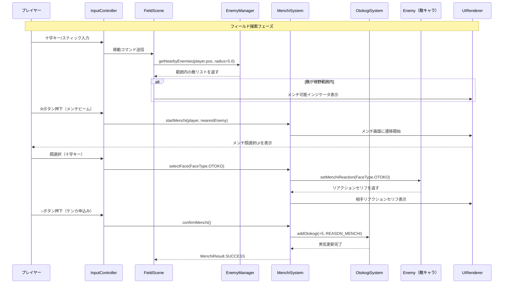
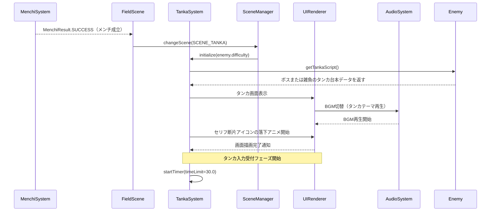
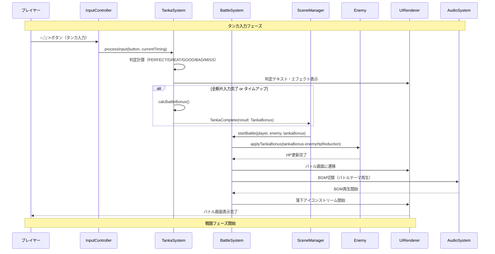
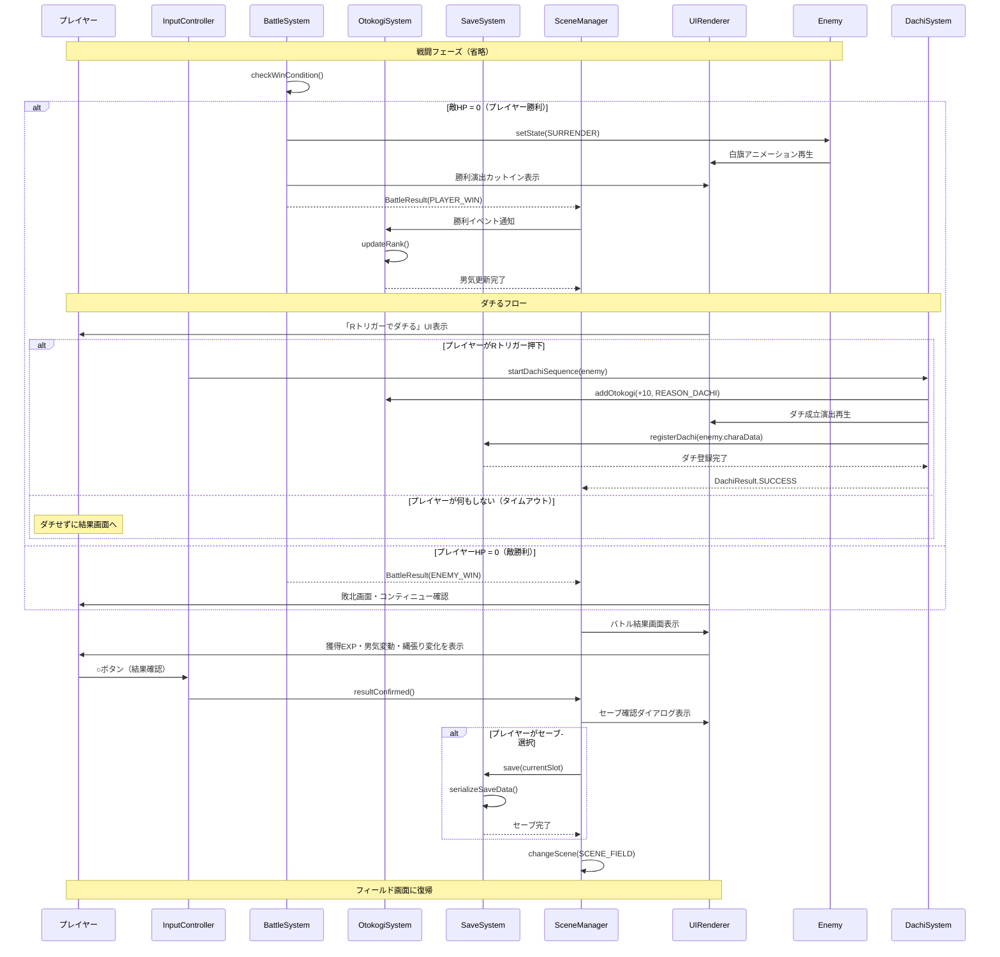

# シーケンス図 — 喧嘩番長5 漢の法則

## シーケンス1：フィールドでの遭遇〜メンチ開始

```mermaid
sequenceDiagram
    participant Player as プレイヤー
    participant InputCtrl as InputController
    participant FieldScene as FieldScene
    participant EnemyMgr as EnemyManager
    participant MenchiSys as MenchiSystem
    participant OtokogiSys as OtokogiSystem
    participant Enemy as Enemy（敵キャラ）
    participant Renderer as UIRenderer

    Note over Player, Renderer: フィールド探索フェーズ
    Player ->> InputCtrl: 十字キー/スティック入力
    InputCtrl ->> FieldScene: 移動コマンド送信
    FieldScene ->> EnemyMgr: getNearbyEnemies(player.pos, radius=5.0)
    EnemyMgr -->> FieldScene: 範囲内の敵リストを返す

    alt 敵が視野範囲内
        FieldScene ->> Renderer: メンチ可能インジケータ表示
    end

    Player ->> InputCtrl: Rボタン押下（メンチビーム）
    InputCtrl ->> MenchiSys: startMenchi(player, nearestEnemy)
    MenchiSys ->> Renderer: メンチ画面に遷移開始
    Renderer -->> Player: メンチ顔選択UIを表示

    Player ->> InputCtrl: 顔選択（十字キー）
    InputCtrl ->> MenchiSys: selectFace(FaceType.OTOKO)
    MenchiSys ->> Enemy: setMenchiReaction(FaceType.OTOKO)
    Enemy -->> MenchiSys: リアクションセリフを返す
    MenchiSys ->> Renderer: 相手リアクションセリフ表示

    Player ->> InputCtrl: ○ボタン押下（ケンカ申込み）
    InputCtrl ->> MenchiSys: confirmMenchi()
    MenchiSys ->> OtokogiSys: addOtokogi(+5, REASON_MENCHI)
    OtokogiSys -->> MenchiSys: 男気更新完了
    MenchiSys -->> FieldScene: MenchiResult.SUCCESS
```

---

## シーケンス2：メンチ勝利〜タンカ開始

```mermaid
sequenceDiagram
    participant MenchiSys as MenchiSystem
    participant FieldScene as FieldScene
    participant TankaSys as TankaSystem
    participant SceneMgr as SceneManager
    participant Renderer as UIRenderer
    participant AudioSys as AudioSystem
    participant Enemy as Enemy

    MenchiSys -->> FieldScene: MenchiResult.SUCCESS（メンチ成立）
    FieldScene ->> SceneMgr: changeScene(SCENE_TANKA)
    SceneMgr ->> TankaSys: initialize(enemy.difficulty)

    TankaSys ->> Enemy: getTankaScript()
    Enemy -->> TankaSys: ボスまたは雑魚のタンカ台本データを返す

    TankaSys ->> Renderer: タンカ画面表示
    Renderer ->> AudioSys: BGM切替（タンカテーマ再生）
    AudioSys -->> Renderer: BGM再生開始

    TankaSys ->> Renderer: セリフ断片アイコンの落下アニメ開始
    Renderer -->> TankaSys: 画面描画完了通知

    Note over TankaSys, Renderer: タンカ入力受付フェーズ開始
    TankaSys ->> TankaSys: startTimer(timeLimit=30.0)
```

---

## シーケンス3：タンカ結果〜戦闘開始

```mermaid
sequenceDiagram
    participant Player as プレイヤー
    participant InputCtrl as InputController
    participant TankaSys as TankaSystem
    participant BattleSys as BattleSystem
    participant SceneMgr as SceneManager
    participant Enemy as Enemy
    participant Renderer as UIRenderer
    participant AudioSys as AudioSystem

    Note over Player, AudioSys: タンカ入力フェーズ
    Player ->> InputCtrl: ○△□×ボタン（タンカ入力）
    InputCtrl ->> TankaSys: processInput(button, currentTiming)
    TankaSys ->> TankaSys: 判定計算（PERFECT/GREAT/GOOD/BAD/MISS）
    TankaSys ->> Renderer: 判定テキスト・エフェクト表示

    alt 全断片入力完了 or タイムアップ
        TankaSys ->> TankaSys: calcBattleBonus()
        TankaSys -->> SceneMgr: TankaComplete(result: TankaBonus)
    end

    SceneMgr ->> BattleSys: startBattle(player, enemy, tankaBonus)
    BattleSys ->> Enemy: applyTankaBonus(tankaBonus.enemyHpReduction)
    Enemy -->> BattleSys: HP更新完了

    BattleSys ->> Renderer: バトル画面に遷移
    BattleSys ->> AudioSys: BGM切替（バトルテーマ再生）
    AudioSys -->> BattleSys: BGM再生開始

    BattleSys ->> Renderer: 落下アイコンストリーム開始
    Renderer -->> Player: バトル画面表示完了

    Note over Player, Renderer: 戦闘フェーズ開始
```

---

## シーケンス4：戦闘終了〜男気更新〜結果画面

```mermaid
sequenceDiagram
    participant Player as プレイヤー
    participant InputCtrl as InputController
    participant BattleSys as BattleSystem
    participant OtokogiSys as OtokogiSystem
    participant SaveSys as SaveSystem
    participant SceneMgr as SceneManager
    participant Renderer as UIRenderer
    participant Enemy as Enemy
    participant DachiSys as DachiSystem

    Note over Player, Enemy: 戦闘フェーズ（省略）

    BattleSys ->> BattleSys: checkWinCondition()

    alt 敵HP = 0（プレイヤー勝利）
        BattleSys ->> Enemy: setState(SURRENDER)
        Enemy ->> Renderer: 白旗アニメーション再生
        BattleSys ->> Renderer: 勝利演出カットイン表示
        BattleSys -->> SceneMgr: BattleResult(PLAYER_WIN)

        SceneMgr ->> OtokogiSys: 勝利イベント通知
        OtokogiSys ->> OtokogiSys: updateRank()
        OtokogiSys -->> SceneMgr: 男気更新完了

        Note over Player, DachiSys: ダチるフロー
        Renderer ->> Player: 「Rトリガーでダチる」UI表示

        alt プレイヤーがRトリガー押下
            InputCtrl ->> DachiSys: startDachiSequence(enemy)
            DachiSys ->> OtokogiSys: addOtokogi(+10, REASON_DACHI)
            DachiSys ->> Renderer: ダチ成立演出再生
            DachiSys ->> SaveSys: registerDachi(enemy.charaData)
            SaveSys -->> DachiSys: ダチ登録完了
            DachiSys -->> SceneMgr: DachiResult.SUCCESS
        else プレイヤーが何もしない（タイムアウト）
            Note over Player: ダチせずに結果画面へ
        end

    else プレイヤーHP = 0（敵勝利）
        BattleSys -->> SceneMgr: BattleResult(ENEMY_WIN)
        Renderer ->> Player: 敗北画面・コンティニュー確認
    end

    SceneMgr ->> Renderer: バトル結果画面表示
    Renderer ->> Player: 獲得EXP・男気変動・縄張り変化を表示

    Player ->> InputCtrl: ○ボタン（結果確認）
    InputCtrl ->> SceneMgr: resultConfirmed()
    SceneMgr ->> Renderer: セーブ確認ダイアログ表示

    alt プレイヤーがセーブ選択
        SceneMgr ->> SaveSys: save(currentSlot)
        SaveSys ->> SaveSys: serializeSaveData()
        SaveSys -->> SceneMgr: セーブ完了
    end

    SceneMgr ->> SceneMgr: changeScene(SCENE_FIELD)
    Note over Player, Renderer: フィールド画面に復帰
```
