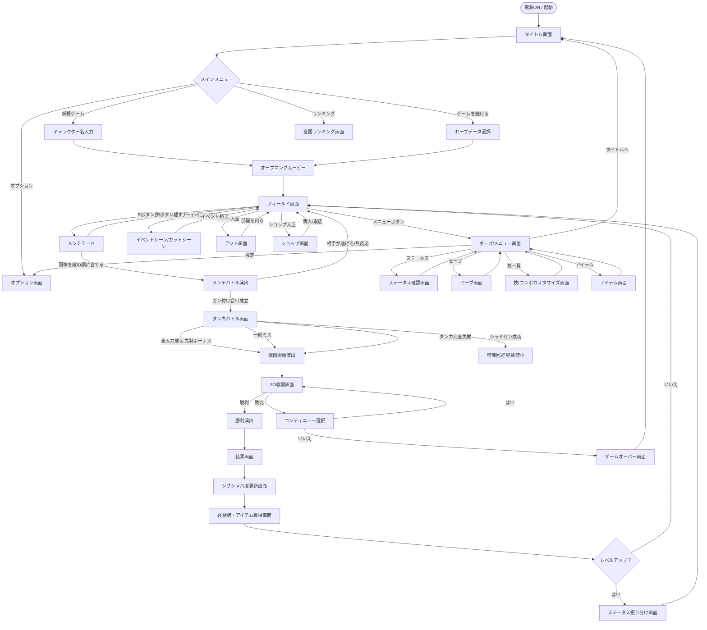

# 画面遷移図 — 喧嘩番長6 Soul & Blood

## Mermaid フローチャート

---

## 各画面の説明一覧テーブル

| No. | 画面名 | 説明 | 主な操作 | 遷移先 |
|-----|--------|------|----------|--------|
| 1 | タイトル画面 | ゲーム起動後のロゴ表示画面。フルボイスのオープニングデモが流れる | Aボタンでスタート | メインメニュー |
| 2 | メインメニュー | ゲーム開始/継続、オプション、ランキングを選択 | 十字キー選択、Aボタン決定 | 各種画面 |
| 3 | キャラクター名入力 | 主人公・朝比奈大吾の名前をプレイヤーが設定 | 仮名入力（ソフトウェアキーボード） | オープニング |
| 4 | セーブデータ選択 | 3スロットから継続するデータを選択 | 十字キー選択、Aボタン決定 | オープニング/フィールド |
| 5 | オプション画面 | 音量・立体視強度・ボタン割り当てなど設定 | 十字キー＋Aボタン | メインメニュー |
| 6 | 全国ランキング画面 | Wi-Fi経由のオンラインランキング閲覧・バトル参加 | 十字キー、Aボタン | メインメニュー |
| 7 | オープニングムービー | ゲーム冒頭の導入アニメーション（スキップ可） | STARTでスキップ | フィールド |
| 8 | フィールド画面 | メインゲームプレイ画面。3D空間を自由に探索 | スライドパッド移動、各ボタンアクション | 各種画面 |
| 9 | メンチモード | Rボタン長押しで発動。照準で敵にメンチを切る | スライドパッド照準移動 | メンチバトル/フィールド |
| 10 | タンカバトル画面 | 下画面に入力ガイド、上画面にキャラ演出 | スライドパッド方向入力 | 戦闘開始/喧嘩回避 |
| 11 | 3D戦闘画面 | 3Dアクション格闘。Y・X・A・Lを駆使して戦う | Y弱攻撃、X強攻撃、A掴み、L防御 | 結果画面/コンティニュー |
| 12 | 結果画面 | 戦闘終了後の勝利演出・獲得物表示 | Aボタンで続行 | シブシャバ度更新 |
| 13 | シブシャバ度更新画面 | 戦闘中の行動評価でシブシャバ度が変動する演出 | Aボタンで続行 | 経験値獲得画面 |
| 14 | ステータス振り分け画面 | レベルアップ時に4ポイントを5パラメータへ配分 | 十字キー選択、Aボタン決定 | フィールド |
| 15 | ポーズ/メニュー画面 | フィールド中の一時停止メニュー | STARTボタンで開閉 | ステータス/セーブ等 |
| 16 | ステータス確認画面 | キャラクターのパラメータ・称号・装備を確認 | 十字キーでタブ切替 | ポーズメニュー |
| 17 | セーブ画面 | 3スロットへのセーブ操作 | 十字キー選択、Aボタン決定 | ポーズメニュー |
| 18 | 技/コンボカスタマイズ画面 | 習得済みの技をコンボリストにカスタマイズ登録 | 十字キー選択、A登録 | ポーズメニュー |
| 19 | アジト画面 | 空き部室をカスタマイズ。家具購入・配置 | タッチスクリーン対応 | フィールド |
| 20 | ショップ画面 | アイテム・セリフ・道具を購入する | 十字キー選択、Aボタン決定 | フィールド |
| 21 | ゲームオーバー画面 | 戦闘で全滅後のゲームオーバー表示 | Aボタンでタイトルへ | タイトル画面 |
| 22 | コンティニュー選択画面 | 敗北時に再挑戦するか選択 | Aボタン（はい）、Bボタン（いいえ） | 戦闘画面/ゲームオーバー |
| 23 | イベントシーン画面 | ストーリーイベント・カットシーン再生 | Aで次のセリフ、STARTでスキップ | フィールド |
