# クラス図 — 喧嘩番長6 Soul & Blood

## Mermaid クラス図

```mermaid
classDiagram
    class GameManager {
        +SceneManager sceneManager
        +SystemRegistry systems
        +SaveManager saveManager
        +start() void
        +update(dt: float) void
        +changeScene(scene: Scene) void
        +getInstance() GameManager
    }

    class SceneManager {
        -currentScene : Scene
        -sceneStack : Scene[]
        +push(scene: Scene) void
        +pop() void
        +replace(scene: Scene) void
        +getCurrentScene() Scene
    }

    class Scene {
        <<abstract>>
        +enter() void
        +exit() void
        +update(dt: float) void
        +render() void
    }

    class FieldScene {
        +StageManager stageManager
        +Player player
        +Enemy[] enemies
        +MenchiSystem menchiSystem
        +update(dt: float) void
        +render() void
    }

    class BattleScene {
        +Player player
        +Enemy[] opponents
        +CombatSystem combatSystem
        +BattleResult result
        +start(opponents: Enemy[]) void
        +update(dt: float) void
        +render() void
    }

    class TankaScene {
        +TankaSystem tankaSystem
        +Player player
        +Enemy enemy
        +TankaResult result
        +start(enemy: Enemy) void
        +handleInput(dir: Direction) void
    }

    class Player {
        +string name
        +int level
        +PlayerStats stats
        +ShibuShabaStatus shibuShaba
        +Inventory inventory
        +List~Move~ moves
        +int schoolBadgeCount
        +move(direction: Vector3) void
        +attack(type: AttackType) void
        +guard() void
        +dodge(direction: Vector3) void
        +useMenchi() void
        +gainExp(amount: int) void
        +levelUp() void
    }

    class PlayerStats {
        +int hp
        +int maxHp
        +int sp
        +int maxSp
        +int attack
        +int defense
        +int spirit
        +int level
        +int exp
        +int expToNext
        +distribute(param: StatType, points: int) void
    }

    class Enemy {
        +string name
        +string title
        +EnemyStats stats
        +AIBehavior ai
        +EnemyType type
        +SchoolBadge badge
        +update(dt: float) void
        +takeDamage(amount: int) void
        +isDefeated() bool
    }

    class EnemyStats {
        +int hp
        +int maxHp
        +int attack
        +int defense
        +int menchiRank
        +int expReward
        +int moneyReward
    }

    class CombatSystem {
        +Player player
        +Enemy[] opponents
        +HitDetection hitDetection
        +ComboTracker combo
        +update(dt: float) void
        +processAttack(attacker: Character, move: Move) void
        +resolveHit(attacker: Character, target: Character, move: Move) DamageResult
        +checkOraOra() bool
        +applyKiaiGaugeChange(amount: int) void
    }

    class HitDetection {
        +checkHitboxOverlap(a: Hitbox, b: Hitbox) bool
        +getHitboxes(character: Character) Hitbox[]
        +activeHitboxesForFrame(move: Move, frame: int) Hitbox[]
    }

    class MenchiSystem {
        +Player player
        +Enemy[] nearbyEnemies
        +bool isActive
        +float beamRange
        +activate() void
        +deactivate() void
        +fire(target: Enemy) MenchiResult
        +calculateAccuracy(player: Player, target: Enemy) float
        +updateShibuShaba(result: MenchiResult) void
    }

    class TankaSystem {
        +List~TankaInput~ sequence
        +int currentIndex
        +float timeLimit
        +bool cheated
        +start(enemy: Enemy) void
        +handleInput(direction: Direction) TankaInputResult
        +activateShamisen() ShamisenResult
        +cheat() void
        +getResult() TankaResult
    }

    class OtokogiSystem {
        +int shibuShabaValue
        +void applyAction(action: OtokogiAction) void
        +void update() void
        +OtokogiRank getRank() 
        +bool isShibuGod()
        +bool isShabaGod()
    }

    class StageManager {
        +Stage currentStage
        +List~Stage~ stages
        +int treatmentPercent
        +loadStage(stageId: int) void
        +getEnemiesInRange(pos: Vector3) Enemy[]
        +updateTreatment(delta: int) void
        +getTreatmentPercent() int
    }

    class Stage {
        +int id
        +string name
        +string areaName
        +List~EnemySpawnData~ spawnData
        +List~EventTrigger~ triggers
        +int bossEnemyId
        +int bgmId
        +int treatmentLevel
    }

    class AIBehavior {
        <<abstract>>
        +Character owner
        +update(dt: float) void
        +decidAction() AIAction
    }

    class PatrolBehavior {
        +Vector3[] waypoints
        +int currentWaypoint
        +update(dt: float) void
        +decidAction() AIAction
    }

    class AggressiveBehavior {
        +float attackRange
        +float aggroRange
        +update(dt: float) void
        +decidAction() AIAction
    }

    class BossBehavior {
        +BossPhase currentPhase
        +List~BossSkill~ skills
        +update(dt: float) void
        +decidAction() AIAction
        +checkPhaseTransition() void
        +executeSkill(skill: BossSkill) void
    }

    class Move {
        +int id
        +string name
        +MoveType type
        +int power
        +int spCost
        +bool shibuPenalty
        +execute(user: Character) void
    }

    class SaveManager {
        +int currentSlot
        +SaveData[] slots
        +save(slot: int) bool
        +load(slot: int) SaveData
        +exists(slot: int) bool
        +delete(slot: int) void
    }

    class SaveData {
        +int slot
        +string playerName
        +PlayerStats stats
        +int chapter
        +int semester
        +bool[] storyFlags
        +int shibuShabaValue
        +int schoolBadgeCount
        +List~int~ learnedMoveIds
        +DateTime saveTime
    }

    class Inventory {
        +List~Item~ items
        +int money
        +addItem(item: Item) void
        +removeItem(item: Item) void
        +useItem(item: Item, target: Character) void
    }

    class Item {
        +int id
        +string name
        +ItemEffect effect
        +int price
        +use(target: Character) void
    }

    %% 継承関係
    Scene <|-- FieldScene
    Scene <|-- BattleScene
    Scene <|-- TankaScene
    AIBehavior <|-- PatrolBehavior
    AIBehavior <|-- AggressiveBehavior
    AIBehavior <|-- BossBehavior

    %% 集約・依存関係
    GameManager --> SceneManager : manages
    GameManager --> SaveManager : uses
    SceneManager --> Scene : contains

    FieldScene --> Player : has
    FieldScene --> StageManager : uses
    FieldScene --> MenchiSystem : uses

    BattleScene --> Player : has
    BattleScene --> CombatSystem : uses

    TankaScene --> TankaSystem : uses
    TankaScene --> OtokogiSystem : notifies

    Player --> PlayerStats : has
    Player --> Inventory : has
    Player --> Move : learns

    Enemy --> EnemyStats : has
    Enemy --> AIBehavior : uses

    CombatSystem --> HitDetection : uses
    CombatSystem --> OtokogiSystem : notifies

    MenchiSystem --> OtokogiSystem : notifies

    StageManager --> Stage : manages

    SaveManager --> SaveData : persists
```

---

## クラス補足説明

| クラス名 | 役割 | 備考 |
|---------|------|------|
| GameManager | ゲーム全体の統括管理（シングルトン） | システム初期化・更新ループ制御 |
| SceneManager | シーン遷移管理 | スタック構造でシーンを管理 |
| FieldScene | フィールド探索シーンの制御 | メンチ発動判定もここで管理 |
| BattleScene | 格闘戦シーンの制御 | 戦闘結果をOtokogiSystemへ通知 |
| TankaScene | タンカバトルシーンの制御 | 下画面のタッチUI制御も担当 |
| Player | 主人公キャラクターの全データ・操作 | 名前変更可能（SaveDataに保存） |
| Enemy | 敵キャラクターの全データ・AI参照 | タイプによってAIBehaviorを切替 |
| CombatSystem | 戦闘ロジックの中枢 | フレーム単位でヒットボックス判定 |
| MenchiSystem | メンチビームの発射・判定 | シブシャバ度への影響も管理 |
| TankaSystem | タンカ入力シーケンスの管理 | シャミセンシステムも含む |
| OtokogiSystem | シブシャバ度の更新・管理 | 各システムから通知を受ける |
| StageManager | ステージデータ・治安管理 | 敵スポーン制御も担当 |
| SaveManager | セーブデータの読み書き | 3スロット対応 |
