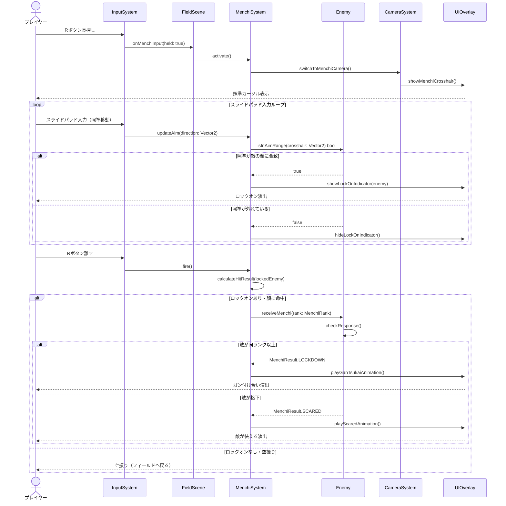
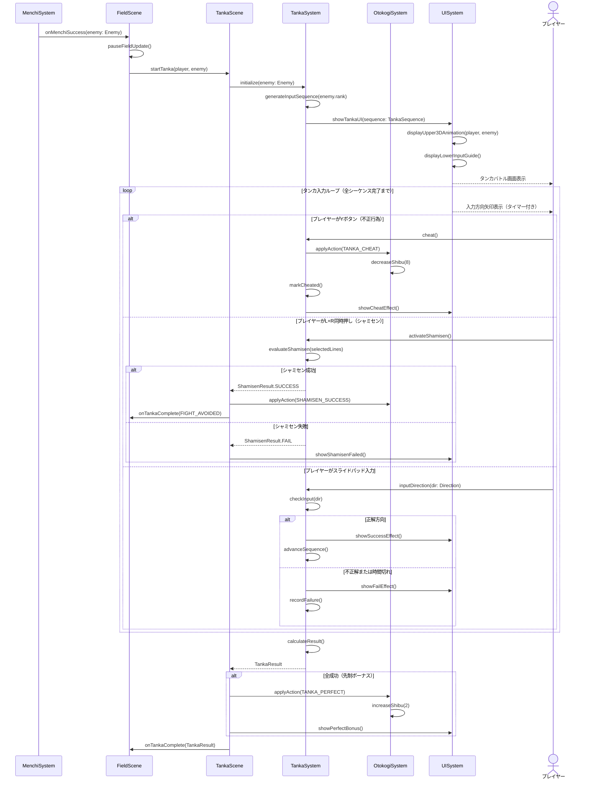
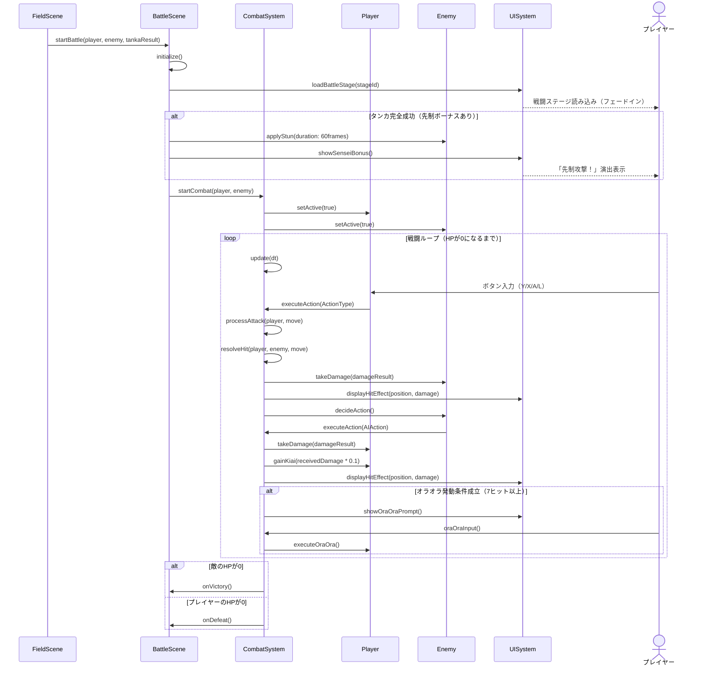
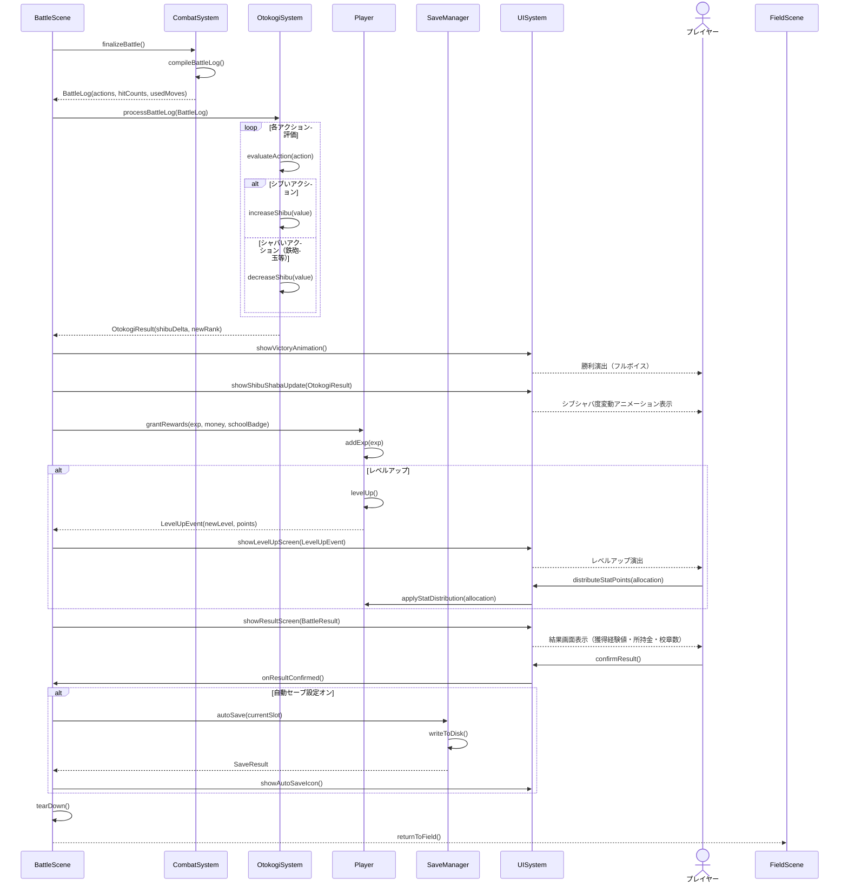

# シーケンス図 — 喧嘩番長6 Soul & Blood

---

## シーケンス1：フィールドでの遭遇〜メンチ開始

```mermaid
sequenceDiagram
    actor Player as プレイヤー
    participant InputSys as InputSystem
    participant FieldScene as FieldScene
    participant MenchiSys as MenchiSystem
    participant Enemy as Enemy
    participant Camera as CameraSystem
    participant UI as UIOverlay

    Player ->> InputSys: Rボタン長押し
    InputSys ->> FieldScene: onMenchiInput(held: true)
    FieldScene ->> MenchiSys: activate()
    MenchiSys ->> Camera: switchToMenchiCamera()
    Camera ->> UI: showMenchiCrosshair()
    UI -->> Player: 照準カーソル表示

    loop スライドパッド入力ループ
        Player ->> InputSys: スライドパッド入力（照準移動）
        InputSys ->> MenchiSys: updateAim(direction: Vector2)
        MenchiSys ->> Enemy: isInAimRange(crosshair: Vector2) bool
        alt 照準が敵の顔に合致
            Enemy -->> MenchiSys: true
            MenchiSys ->> UI: showLockOnIndicator(enemy)
            UI -->> Player: ロックオン演出
        else 照準が外れている
            Enemy -->> MenchiSys: false
            MenchiSys ->> UI: hideLockOnIndicator()
        end
    end

    Player ->> InputSys: Rボタン離す
    InputSys ->> MenchiSys: fire()
    MenchiSys ->> MenchiSys: calculateHitResult(lockedEnemy)
    
    alt ロックオンあり・顔に命中
        MenchiSys ->> Enemy: receiveMenchi(rank: MenchiRank)
        Enemy ->> Enemy: checkResponse()
        alt 敵が同ランク以上
            Enemy -->> MenchiSys: MenchiResult.LOCKDOWN
            MenchiSys ->> UI: playGanTsukaiAnimation()
            UI -->> Player: ガン付け合い演出
        else 敵が格下
            Enemy -->> MenchiSys: MenchiResult.SCARED
            MenchiSys ->> UI: playScaredAnimation()
            UI -->> Player: 敵が怯える演出
        end
    else ロックオンなし・空振り
        MenchiSys -->> Player: 空振り（フィールドへ戻る）
    end
```

---

## シーケンス2：メンチ勝利〜タンカ開始

```mermaid
sequenceDiagram
    participant MenchiSys as MenchiSystem
    participant FieldScene as FieldScene
    participant TankaScene as TankaScene
    participant TankaSys as TankaSystem
    participant OtokogiSys as OtokogiSystem
    participant UI as UISystem
    actor Player as プレイヤー

    MenchiSys ->> FieldScene: onMenchiSuccess(enemy: Enemy)
    FieldScene ->> FieldScene: pauseFieldUpdate()
    FieldScene ->> TankaScene: startTanka(player, enemy)
    
    TankaScene ->> TankaSys: initialize(enemy: Enemy)
    TankaSys ->> TankaSys: generateInputSequence(enemy.rank)
    TankaSys ->> UI: showTankaUI(sequence: TankaSequence)
    UI ->> UI: displayUpper3DAnimation(player, enemy)
    UI ->> UI: displayLowerInputGuide()
    UI -->> Player: タンカバトル画面表示

    loop タンカ入力ループ（全シーケンス完了まで）
        UI -->> Player: 入力方向矢印表示（タイマー付き）
        
        alt プレイヤーがYボタン（不正行為）
            Player ->> TankaSys: cheat()
            TankaSys ->> OtokogiSys: applyAction(TANKA_CHEAT)
            OtokogiSys ->> OtokogiSys: decreaseShibu(8)
            TankaSys ->> TankaSys: markCheated()
            TankaSys ->> UI: showCheatEffect()
        else プレイヤーがL+R同時押し（シャミセン）
            Player ->> TankaSys: activateShamisen()
            TankaSys ->> TankaSys: evaluateShamisen(selectedLines)
            alt シャミセン成功
                TankaSys -->> TankaScene: ShamisenResult.SUCCESS
                TankaScene ->> OtokogiSys: applyAction(SHAMISEN_SUCCESS)
                TankaScene ->> FieldScene: onTankaComplete(FIGHT_AVOIDED)
            else シャミセン失敗
                TankaSys -->> TankaScene: ShamisenResult.FAIL
                TankaScene ->> UI: showShamisenFailed()
            end
        else プレイヤーがスライドパッド入力
            Player ->> TankaSys: inputDirection(dir: Direction)
            TankaSys ->> TankaSys: checkInput(dir)
            alt 正解方向
                TankaSys ->> UI: showSuccessEffect()
                TankaSys ->> TankaSys: advanceSequence()
            else 不正解または時間切れ
                TankaSys ->> UI: showFailEffect()
                TankaSys ->> TankaSys: recordFailure()
            end
        end
    end

    TankaSys ->> TankaSys: calculateResult()
    TankaSys -->> TankaScene: TankaResult

    alt 全成功（先制ボーナス）
        TankaScene ->> OtokogiSys: applyAction(TANKA_PERFECT)
        OtokogiSys ->> OtokogiSys: increaseShibu(2)
        TankaScene ->> UI: showPerfectBonus()
    end
    
    TankaScene ->> FieldScene: onTankaComplete(TankaResult)
```

---

## シーケンス3：タンカ結果〜戦闘開始

```mermaid
sequenceDiagram
    participant FieldScene as FieldScene
    participant BattleScene as BattleScene
    participant CombatSys as CombatSystem
    participant Player as Player
    participant Enemy as Enemy
    participant UI as UISystem
    actor Human as プレイヤー

    FieldScene ->> BattleScene: startBattle(player, enemy, tankaResult)
    BattleScene ->> BattleScene: initialize()
    BattleScene ->> UI: loadBattleStage(stageId)
    UI -->> Human: 戦闘ステージ読み込み（フェードイン）

    alt タンカ完全成功（先制ボーナスあり）
        BattleScene ->> Enemy: applyStun(duration: 60frames)
        BattleScene ->> UI: showSenseiBonus()
        UI -->> Human: 「先制攻撃！」演出表示
    end

    BattleScene ->> CombatSys: startCombat(player, enemy)
    CombatSys ->> Player: setActive(true)
    CombatSys ->> Enemy: setActive(true)

    loop 戦闘ループ（HPが0になるまで）
        CombatSys ->> CombatSys: update(dt)
        
        Human ->> Player: ボタン入力（Y/X/A/L）
        Player ->> CombatSys: executeAction(ActionType)
        CombatSys ->> CombatSys: processAttack(player, move)
        CombatSys ->> CombatSys: resolveHit(player, enemy, move)
        CombatSys ->> Enemy: takeDamage(damageResult)
        CombatSys ->> UI: displayHitEffect(position, damage)
        
        CombatSys ->> Enemy: decideAction() 
        Enemy ->> CombatSys: executeAction(AIAction)
        CombatSys ->> Player: takeDamage(damageResult)
        CombatSys ->> Player: gainKiai(receivedDamage * 0.1)
        CombatSys ->> UI: displayHitEffect(position, damage)
        
        alt オラオラ発動条件成立（7ヒット以上）
            CombatSys ->> UI: showOraOraPrompt()
            Human ->> CombatSys: oraOraInput()
            CombatSys ->> Player: executeOraOra()
        end
    end

    alt 敵のHPが0
        CombatSys ->> BattleScene: onVictory()
    else プレイヤーのHPが0
        CombatSys ->> BattleScene: onDefeat()
    end
```

---

## シーケンス4：戦闘終了〜男気更新〜結果画面

```mermaid
sequenceDiagram
    participant BattleScene as BattleScene
    participant CombatSys as CombatSystem
    participant OtokogiSys as OtokogiSystem
    participant Player as Player
    participant SaveMgr as SaveManager
    participant UI as UISystem
    actor Human as プレイヤー

    BattleScene ->> CombatSys: finalizeBattle()
    CombatSys ->> CombatSys: compileBattleLog()
    CombatSys -->> BattleScene: BattleLog(actions, hitCounts, usedMoves)

    BattleScene ->> OtokogiSys: processBattleLog(BattleLog)
    
    loop 各アクション評価
        OtokogiSys ->> OtokogiSys: evaluateAction(action)
        alt シブいアクション
            OtokogiSys ->> OtokogiSys: increaseShibu(value)
        else シャバいアクション（鉄砲玉等）
            OtokogiSys ->> OtokogiSys: decreaseShibu(value)
        end
    end
    
    OtokogiSys -->> BattleScene: OtokogiResult(shibuDelta, newRank)

    BattleScene ->> UI: showVictoryAnimation()
    UI -->> Human: 勝利演出（フルボイス）

    BattleScene ->> UI: showShibuShabaUpdate(OtokogiResult)
    UI -->> Human: シブシャバ度変動アニメーション表示

    BattleScene ->> Player: grantRewards(exp, money, schoolBadge)
    Player ->> Player: addExp(exp)
    
    alt レベルアップ
        Player ->> Player: levelUp()
        Player -->> BattleScene: LevelUpEvent(newLevel, points)
        BattleScene ->> UI: showLevelUpScreen(LevelUpEvent)
        UI -->> Human: レベルアップ演出
        Human ->> UI: distributeStatPoints(allocation)
        UI ->> Player: applyStatDistribution(allocation)
    end

    BattleScene ->> UI: showResultScreen(BattleResult)
    UI -->> Human: 結果画面表示（獲得経験値・所持金・校章数）

    Human ->> UI: confirmResult()
    UI ->> BattleScene: onResultConfirmed()
    
    alt 自動セーブ設定オン
        BattleScene ->> SaveMgr: autoSave(currentSlot)
        SaveMgr ->> SaveMgr: writeToDisk()
        SaveMgr -->> BattleScene: SaveResult
        BattleScene ->> UI: showAutoSaveIcon()
    end

    BattleScene ->> BattleScene: tearDown()
    BattleScene -->> FieldScene: returnToField()
```
