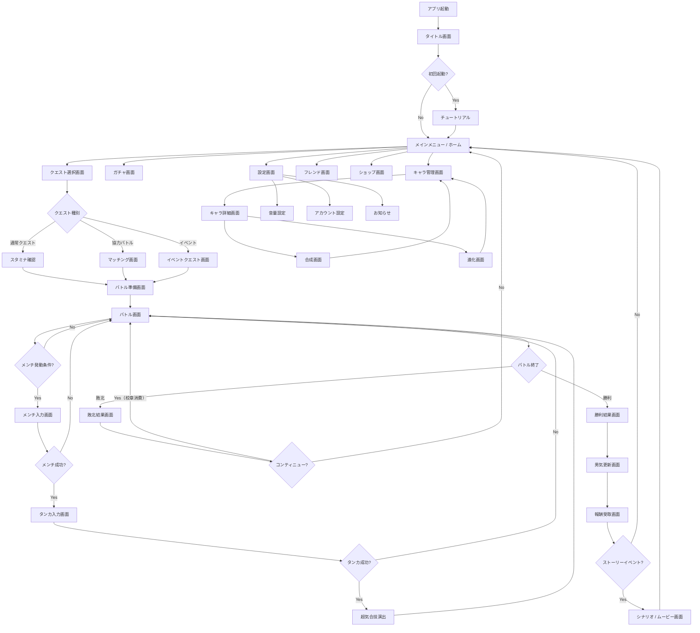

# 画面遷移図 — 東京Bro（喧嘩番長-Crash Battle-）

## 画面遷移フローチャート

---

## 各画面の説明一覧テーブル

| 画面ID | 画面名 | 概要 | 主な遷移元 | 主な遷移先 |
|--------|--------|------|-----------|-----------|
| SCR-001 | タイトル画面 | アプリ起動時のロゴ・タイトル表示。タップでメニューへ | アプリ起動 | メインメニュー / チュートリアル |
| SCR-002 | チュートリアル | 初回起動時のみ表示。ひっぱり操作・メンチ・タンカの基本を説明 | タイトル画面（初回） | メインメニュー |
| SCR-003 | メインメニュー / ホーム | ゲームの中心画面。スタミナ残量・校章残高を常時表示 | 各画面から戻る際 | クエスト、ガチャ、キャラ管理等 |
| SCR-004 | クエスト選択画面 | 通常・協力・イベントのクエスト一覧。スタミナ残量確認 | メインメニュー | バトル準備画面 |
| SCR-005 | マッチング画面 | 協力バトル用。ルーム作成・参加。最大4人まで待機 | クエスト選択 | バトル準備画面 |
| SCR-006 | バトル準備画面 | デッキ確認・リーダー設定。スタミナ消費確認 | クエスト選択 | バトル画面 |
| SCR-007 | バトル画面 | ひっぱりアクションのメインプレイ画面 | バトル準備 | メンチ入力、タンカ入力、結果画面 |
| SCR-008 | メンチ入力画面 | ばらばらになった言葉を正しい順にタップ | バトル画面 | タンカ入力 or バトル画面 |
| SCR-009 | タンカ入力画面 | メンチ成功後に続く言葉タップ入力 | メンチ入力 | 超気合技演出 or バトル画面 |
| SCR-010 | 超気合技演出 | キャラ固有必殺技のフルスクリーン演出 | タンカ入力 | バトル画面 |
| SCR-011 | 勝利結果画面 | バトル勝利時のスコア・報酬表示 | バトル画面 | 男気更新画面 |
| SCR-012 | 敗北結果画面 | バトル敗北時。コンティニュー選択 | バトル画面 | バトル画面 or メインメニュー |
| SCR-013 | 男気更新画面 | 男気値の変動を表示。シブい/シャバい判定 | 勝利結果画面 | 報酬受取画面 |
| SCR-014 | 報酬受取画面 | 経験値・アイテム・キャラ獲得の演出 | 男気更新画面 | メインメニュー or シナリオ |
| SCR-015 | シナリオ / ムービー画面 | ストーリーイベント時のテキスト＋立ち絵演出 | 報酬受取画面 | メインメニュー |
| SCR-016 | ガチャ画面 | 校章消費でキャラガチャ。1回引き・10連引き対応 | メインメニュー | メインメニュー |
| SCR-017 | キャラ管理画面 | 所持キャラ一覧。ソート・フィルター機能 | メインメニュー | キャラ詳細、合成、進化 |
| SCR-018 | キャラ詳細画面 | 個別キャラのステータス・スキル確認 | キャラ管理 | 合成 or 進化 |
| SCR-019 | 合成画面 | 素材キャラを使って選択キャラのLvを上げる | キャラ詳細 | キャラ管理 |
| SCR-020 | 進化画面 | 素材アイテム消費でキャラの★数を上げる | キャラ詳細 | キャラ管理 |
| SCR-021 | ショップ画面 | 校章・スタミナ等の購入（リアルマネー） | メインメニュー | メインメニュー |
| SCR-022 | フレンド画面 | フレンド一覧・申請・サポートキャラ借用 | メインメニュー | メインメニュー |
| SCR-023 | 設定画面 | 音量・アカウント・お知らせ等の設定 | メインメニュー | メインメニュー |
