# クラス図 — 東京Bro（喧嘩番長-Crash Battle-）

## 主要クラス構成図

```mermaid
classDiagram
    class GameManager {
        -SceneManager sceneManager
        -SaveDataManager saveDataManager
        -MasterDataManager masterDataManager
        -NetworkManager networkManager
        +Initialize() void
        +StartGame() void
        +LoadScene(sceneName: string) void
        +GetCurrentGameState() GameState
    }

    class SceneManager {
        -currentScene: Scene
        -sceneStack: List~Scene~
        +PushScene(scene: Scene) void
        +PopScene() void
        +ReplaceScene(scene: Scene) void
    }

    class Character {
        <<abstract>>
        #characterId: int
        #name: string
        #hp: int
        #maxHp: int
        #attackPower: int
        #defensePower: int
        #speed: float
        #level: int
        #rarity: int
        #characterTrait: CharacterTrait
        +TakeDamage(damage: int) void
        +IsDefeated() bool
        +GetStats() CharacterStats
    }

    class PlayerCharacter {
        -ownerId: string
        -skillLevel: int
        -experience: int
        +LevelUp() void
        +Synthesize(material: PlayerCharacter) void
        +Evolve(evolutionMaterial: Item) void
        +GetSkillLevel() int
    }

    class EnemyCharacter {
        -enemyAI: EnemyAI
        -dropItems: List~Item~
        -rewardExp: int
        +ExecuteAI(battleState: BattleState) BattleAction
        +GetDropItems() List~Item~
    }

    class BossCharacter {
        -hpThresholds: float[]
        -phaseActions: Dictionary~float, BossAction~
        -superSpecialMove: SuperSpecialMove
        +CheckPhaseChange() void
        +ExecuteBossAI(battleState: BattleState) BossAction
    }

    class CombatSystem {
        -currentBattle: Battle
        -menchiSystem: MenchiSystem
        -tankaSystem: TankaSystem
        -pullActionSystem: PullActionSystem
        +StartBattle(quest: Quest) void
        +EndBattle(result: BattleResult) void
        +ProcessTurn() void
        +CalculateDamage(attacker: Character, target: Character, pullDistance: float) int
    }

    class PullActionSystem {
        -pullVector: Vector2
        -pullDistance: float
        +StartPull(startPos: Vector2) void
        +UpdatePull(currentPos: Vector2) void
        +ReleasePull() PullResult
        +CalculatePullCoefficient() float
        +ApplyChainMultiplier(hitCount: int) float
    }

    class MenchiSystem {
        -wordFragments: List~WordFragment~
        -timeLimit: float
        -isActive: bool
        -correctOrder: int[]
        +StartMenchi(difficulty: int) void
        +TapFragment(fragmentIndex: int) bool
        +CheckOrder() MenchiResult
        +OnTimeLimitExpired() void
    }

    class TankaSystem {
        -tankaFragments: List~TankaFragment~
        -timeLimit: float
        -targetSuperMove: SuperSpecialMove
        +StartTanka(superMove: SuperSpecialMove) void
        +TapFragment(fragmentIndex: int) bool
        +CheckOrder() TankaResult
        +TriggerSuperSpecialMove(move: SuperSpecialMove) void
    }

    class SuperSpecialMove {
        -moveName: string
        -moveType: SuperMoveType
        -damageMultiplier: float
        -duration: float
        -owner: Character
        +Execute(targets: List~Character~) void
        +GetPreviewText() string
    }

    class OtokogiSystem {
        -currentOtokogi: int
        -maxOtokogi: int
        -otkogiRank: OtokogiRank
        +ModifyOtokogi(amount: int, reason: OtokogiReason) void
        +GetCurrentRank() OtokogiRank
        +GetRankEffects() OtokogiEffects
        +CheckRankChange() void
    }

    class StageManager {
        -stageList: List~Stage~
        -currentStage: Stage
        -clearedStages: HashSet~int~
        +LoadStage(stageId: int) Stage
        +MarkStageCleared(stageId: int, stars: int) void
        +GetNextStage() Stage
        +IsStageUnlocked(stageId: int) bool
    }

    class SaveDataManager {
        -saveData: SaveData
        +Save() void
        +Load() SaveData
        +SyncToServer() void
        +LoadFromServer() void
    }

    class MasterDataManager {
        -characterMaster: Dictionary~int, CharacterMasterData~
        -stageMaster: Dictionary~int, StageMasterData~
        -moveMaster: Dictionary~int, MoveMasterData~
        -itemMaster: Dictionary~int, ItemMasterData~
        +GetCharacterData(id: int) CharacterMasterData
        +GetStageData(id: int) StageMasterData
        +LoadAllMasters() void
    }

    class NetworkManager {
        -baseUrl: string
        -authToken: string
        +SendRequest(endpoint: string, data: object) Response
        +SyncSaveData(saveData: SaveData) void
        +FetchGachaResult(gachaType: GachaType) GachaResult
        +JoinMultiplayerRoom(roomId: string) Room
    }

    class GachaSystem {
        -gachaTable: GachaTable
        -networkManager: NetworkManager
        +DrawSingle(currency: int) GachaResult
        +DrawTen(currency: int) GachaResult[]
        +GetCurrentRates() RateTable
    }

    class EnemyAI {
        <<interface>>
        +DecideAction(battleState: BattleState) BattleAction
        +GetMovementTarget() Vector2
    }

    class StandardEnemyAI {
        -state: AIState
        -detectionRange: float
        +DecideAction(battleState: BattleState) BattleAction
        +GetMovementTarget() Vector2
    }

    class BossAI {
        -currentPhase: int
        -turnCounter: int
        +DecideAction(battleState: BattleState) BattleAction
        +CheckPhaseTransition() void
        +SelectSpecialAction() BossAction
    }

    %% 継承関係
    Character <|-- PlayerCharacter
    Character <|-- EnemyCharacter
    EnemyCharacter <|-- BossCharacter
    EnemyAI <|.. StandardEnemyAI
    EnemyAI <|.. BossAI

    %% 集約・依存関係
    GameManager o-- SceneManager
    GameManager o-- SaveDataManager
    GameManager o-- MasterDataManager
    GameManager o-- NetworkManager
    CombatSystem o-- MenchiSystem
    CombatSystem o-- TankaSystem
    CombatSystem o-- PullActionSystem
    CombatSystem o-- OtokogiSystem
    TankaSystem --> SuperSpecialMove
    EnemyCharacter o-- EnemyAI
    BossCharacter o-- BossAI
    BossCharacter o-- SuperSpecialMove
    StageManager --> MasterDataManager
    SaveDataManager --> NetworkManager
    GachaSystem --> NetworkManager
```

---

## クラス説明補足

| クラス名 | 役割 |
|---------|------|
| GameManager | ゲーム全体のライフサイクル管理。シングルトンパターン |
| Character | プレイヤー・敵キャラの共通基底クラス。抽象クラス |
| PullActionSystem | ひっぱりアクション専用の物理計算・入力処理 |
| MenchiSystem | メンチビームの入力受付・判定処理を独立管理 |
| TankaSystem | タンカバトルの入力・超気合技トリガーを管理 |
| OtokogiSystem | 男気ゲージの変動・ランク判定をゲーム全体で一元管理 |
| GachaSystem | ガチャ確率・サーバー通信をカプセル化 |
