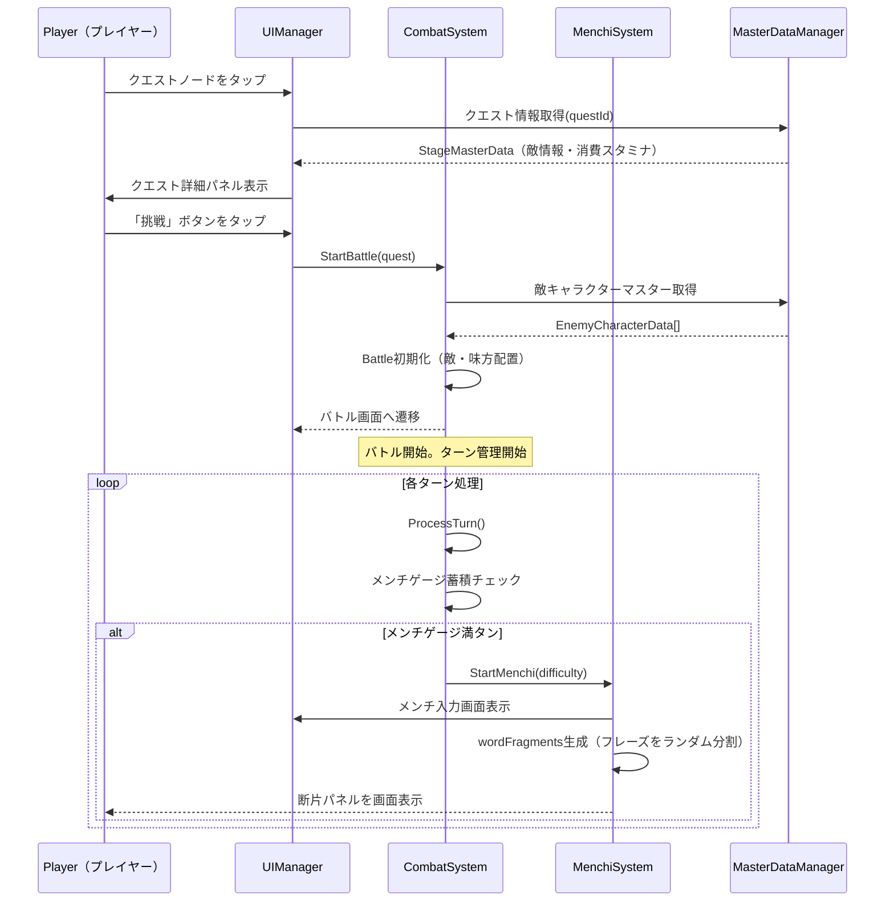
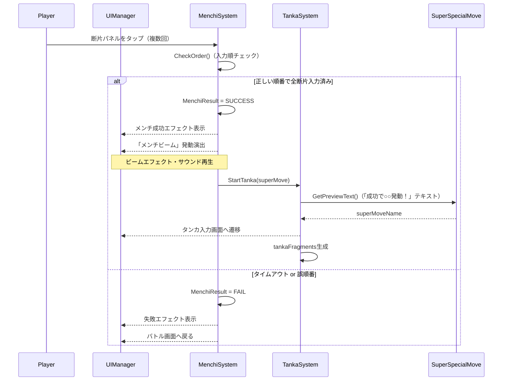
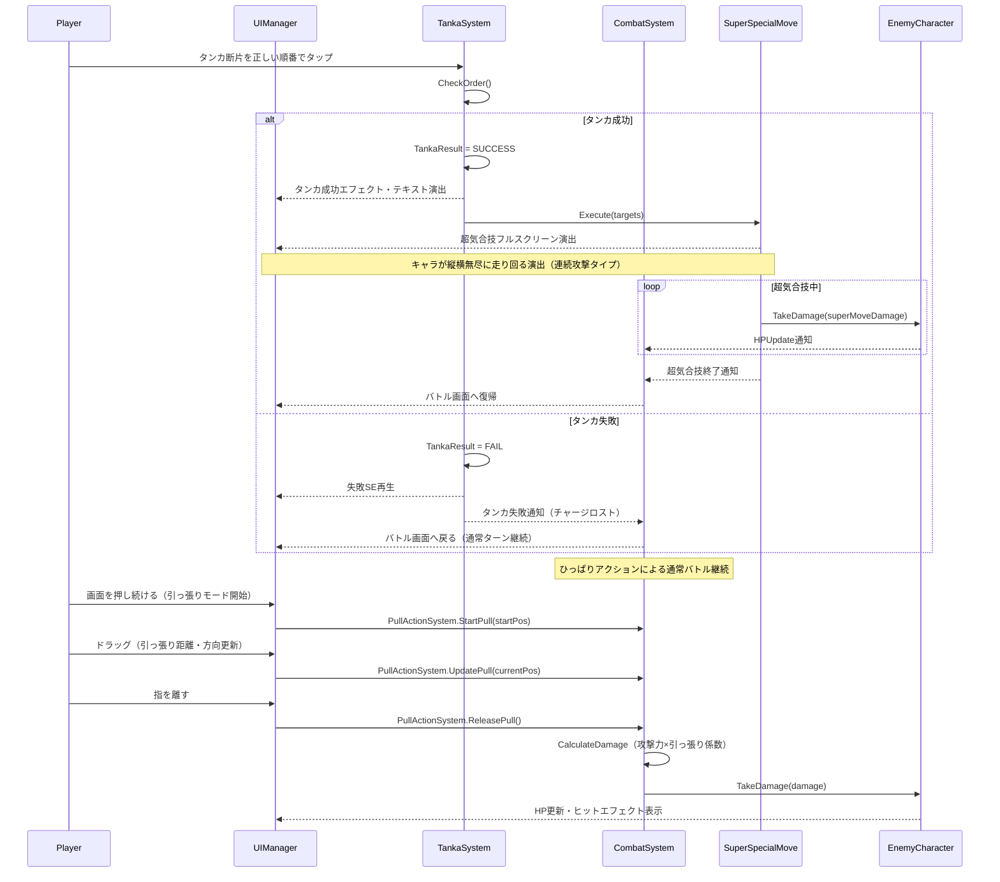
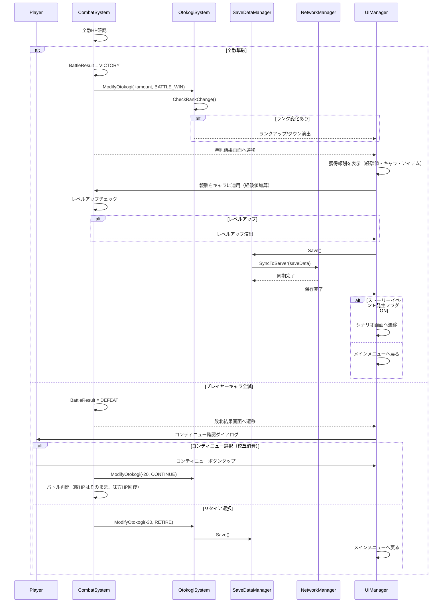

# シーケンス図 — 東京Bro（喧嘩番長-Crash Battle-）

## シーケンス 1：フィールドでの遭遇〜メンチ開始

```mermaid
sequenceDiagram
    participant P as Player（プレイヤー）
    participant UI as UIManager
    participant CS as CombatSystem
    participant MS as MenchiSystem
    participant MD as MasterDataManager

    P->>UI: クエストノードをタップ
    UI->>MD: クエスト情報取得(questId)
    MD-->>UI: StageMasterData（敵情報・消費スタミナ）
    UI->>P: クエスト詳細パネル表示
    P->>UI: 「挑戦」ボタンをタップ
    UI->>CS: StartBattle(quest)
    CS->>MD: 敵キャラクターマスター取得
    MD-->>CS: EnemyCharacterData[]
    CS->>CS: Battle初期化（敵・味方配置）
    CS-->>UI: バトル画面へ遷移
    Note over CS: バトル開始。ターン管理開始

    loop 各ターン処理
        CS->>CS: ProcessTurn()
        CS->>CS: メンチゲージ蓄積チェック
        alt メンチゲージ満タン
            CS->>MS: StartMenchi(difficulty)
            MS->>UI: メンチ入力画面表示
            MS->>MS: wordFragments生成（フレーズをランダム分割）
            MS-->>P: 断片パネルを画面表示
        end
    end
```

---

## シーケンス 2：メンチ勝利〜タンカ開始

```mermaid
sequenceDiagram
    participant P as Player
    participant UI as UIManager
    participant MS as MenchiSystem
    participant TS as TankaSystem
    participant SS as SuperSpecialMove

    P->>MS: 断片パネルをタップ（複数回）
    MS->>MS: CheckOrder()（入力順チェック）
    alt 正しい順番で全断片入力済み
        MS->>MS: MenchiResult = SUCCESS
        MS-->>UI: メンチ成功エフェクト表示
        MS-->>UI: 「メンチビーム」発動演出
        Note over MS,UI: ビームエフェクト・サウンド再生
        MS->>TS: StartTanka(superMove)
        TS->>SS: GetPreviewText()（「成功で○○発動！」テキスト）
        SS-->>TS: superMoveName
        TS-->>UI: タンカ入力画面へ遷移
        TS->>TS: tankaFragments生成
    else タイムアウト or 誤順番
        MS->>MS: MenchiResult = FAIL
        MS-->>UI: 失敗エフェクト表示
        MS-->>UI: バトル画面へ戻る
    end
```

---

## シーケンス 3：タンカ結果〜戦闘開始

```mermaid
sequenceDiagram
    participant P as Player
    participant UI as UIManager
    participant TS as TankaSystem
    participant CS as CombatSystem
    participant SS as SuperSpecialMove
    participant Enemy as EnemyCharacter

    P->>TS: タンカ断片を正しい順番でタップ
    TS->>TS: CheckOrder()
    alt タンカ成功
        TS->>TS: TankaResult = SUCCESS
        TS-->>UI: タンカ成功エフェクト・テキスト演出
        TS->>SS: Execute(targets)
        SS-->>UI: 超気合技フルスクリーン演出
        Note over SS,UI: キャラが縦横無尽に走り回る演出（連続攻撃タイプ）
        loop 超気合技中
            SS->>Enemy: TakeDamage(superMoveDamage)
            Enemy-->>CS: HPUpdate通知
        end
        SS-->>CS: 超気合技終了通知
        CS-->>UI: バトル画面へ復帰
    else タンカ失敗
        TS->>TS: TankaResult = FAIL
        TS-->>UI: 失敗SE再生
        TS-->>CS: タンカ失敗通知（チャージロスト）
        CS-->>UI: バトル画面へ戻る（通常ターン継続）
    end

    Note over CS: ひっぱりアクションによる通常バトル継続
    P->>UI: 画面を押し続ける（引っ張りモード開始）
    UI->>CS: PullActionSystem.StartPull(startPos)
    P->>UI: ドラッグ（引っ張り距離・方向更新）
    UI->>CS: PullActionSystem.UpdatePull(currentPos)
    P->>UI: 指を離す
    UI->>CS: PullActionSystem.ReleasePull()
    CS->>CS: CalculateDamage（攻撃力×引っ張り係数）
    CS->>Enemy: TakeDamage(damage)
    Enemy-->>UI: HP更新・ヒットエフェクト表示
```

---

## シーケンス 4：戦闘終了〜男気更新〜結果画面

```mermaid
sequenceDiagram
    participant P as Player
    participant CS as CombatSystem
    participant OS as OtokogiSystem
    participant SDM as SaveDataManager
    participant NET as NetworkManager
    participant UI as UIManager

    CS->>CS: 全敵HP確認
    alt 全敵撃破
        CS->>CS: BattleResult = VICTORY
        CS->>OS: ModifyOtokogi(+amount, BATTLE_WIN)
        OS->>OS: CheckRankChange()
        alt ランク変化あり
            OS-->>UI: ランクアップ/ダウン演出
        end
        CS-->>UI: 勝利結果画面へ遷移

        UI->>UI: 獲得報酬を表示（経験値・キャラ・アイテム）
        UI->>CS: 報酬をキャラに適用（経験値加算）
        CS->>CS: レベルアップチェック
        alt レベルアップ
            CS-->>UI: レベルアップ演出
        end

        UI->>SDM: Save()
        SDM->>NET: SyncToServer(saveData)
        NET-->>SDM: 同期完了
        SDM-->>UI: 保存完了

        alt ストーリーイベント発生フラグON
            UI->>UI: シナリオ画面へ遷移
        else
            UI->>UI: メインメニューへ戻る
        end

    else プレイヤーキャラ全滅
        CS->>CS: BattleResult = DEFEAT
        CS-->>UI: 敗北結果画面へ遷移
        UI->>P: コンティニュー確認ダイアログ
        alt コンティニュー選択（校章消費）
            P->>UI: コンティニューボタンタップ
            CS->>OS: ModifyOtokogi(-20, CONTINUE)
            CS->>CS: バトル再開（敵HPはそのまま、味方HP回復）
        else リタイア選択
            CS->>OS: ModifyOtokogi(-30, RETIRE)
            OS->>SDM: Save()
            UI->>UI: メインメニューへ戻る
        end
    end
```
